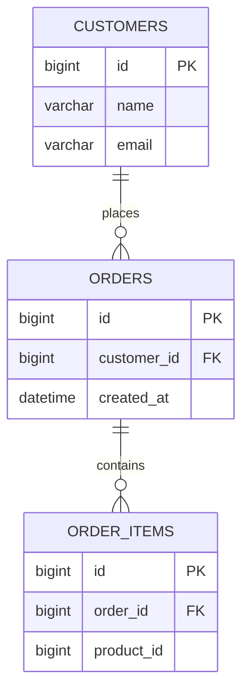

# dbExpert Plugin 개발 요건사항

## 1. 문서 목적

본 문서는 Claude Code에서 설치하여 사용할 수 있는 **DBA 분석 Plugin** 개발을 위한 초기 개발 요건사항을 정의한다.

Plugin의 목적은 Claude Code를 통해 데이터베이스 운영 환경의 장애, 성능, 데이터 파이프라인 문제를 DBA/Data Engineer 관점에서 분석·개선할 수 있도록 지원하는 것이다.

Plugin이 제공하는 Skill은 성격에 따라 크게 세 가지로 구분한다.

1. **Maintenance Skill** — 이미 발생한 장애/에러/Slow Query를 진단하고 원인을 분석
2. **Tuner Skill** — 장애 발생 여부와 무관하게 Index, Query, 통계 정보를 분석하여 구조적 성능 개선안을 제시
3. **DataEngineer Skill** — Raw Data 소스를 탐색하고, 이를 변환하여 Target에 적재하는 데이터 파이프라인을 구성/제안

세 Skill을 공통으로 뒷받침하는 기반 인프라로 다음 두 가지를 둔다.

- **Metadata Ontology & RAG** — Server-Schema-Table-Column의 comment를 계층적 Ontology로 구성하고 RAG로 인덱싱하여, 대부분의 Object 확인(어떤 테이블/컬럼인지)이 이 Ontology 검색을 통해 이루어지도록 한다.
- **Query/Answer Logging & 쿼리 패턴 학습 구조** — 모든 질문/답변을 1건 단위로 Logging하고, 주기적으로 정리하여 서버별 대표 쿼리 패턴을 축적, Plugin이 점진적으로 학습하는 구조로 발전시킨다.

주요 분석 대상은 다음과 같다.

1. DB Error 분석 (Maintenance)
2. Slow Query 분석 (Maintenance)
3. Index 추천 (Tuner)
4. Query Rewrite 제안 (Tuner)
5. Raw Data 탐색 및 Pipeline 구성 제안 (DataEngineer)
6. Object Ontology 기반 검색 및 쿼리 패턴 학습 (공통 기반)
7. 테이블 관계 ERD 시각화 (Mermaid Diagram, 공통 기반)

향후 Lock, Session, 장애 상관관계 분석(Maintenance), Parameter Tuning, Partitioning 제안(Tuner), Data Quality Rule 자동 생성(DataEngineer) 등의 기능을 확장한다.

---

# 2. 목표

최종 사용자는 Claude Code에 Plugin을 설치한 후 별도의 복잡한 실행 방법을 학습하지 않고 자연어로 DB 분석, 튜닝, 파이프라인 구성을 요청할 수 있어야 한다.

예 (Maintenance):

```text
DB error 분석해줘.

최근 10분간 slow query 분석해줘.

5초 이상 실행된 SQL 찾아줘.

이 SQL이 왜 느린지 분석해줘.

현재 lock을 잡고 있는 세션과 대기 세션을 찾아줘.
```

예 (Tuner):

```text
orders 테이블에 어떤 인덱스가 필요할지 추천해줘.

이 쿼리를 더 빠르게 개선해줘.

사용하지 않는 인덱스가 있는지 확인해줘.

이 테이블 통계 정보가 최신인지 확인해줘.
```

예 (DataEngineer):

```text
raw_landing 스키마에 있는 원본 데이터를 찾아줘.

orders_raw를 warehouse.fact_orders로 옮기는 파이프라인을 설계해줘.

이 원본 테이블과 타겟 테이블의 컬럼을 매핑해줘.

증분 적재 파이프라인으로 구성해줘.

이 파이프라인이 실제로 동작할지 샘플로 검증해줘.
```

예 (Ontology 기반 Object 검색):

```text
고객 주문 관련 테이블이 어디 있는지 찾아줘.

이 컬럼이 무슨 의미인지 설명해줘.

이 서버에서 자주 조회되는 테이블이 뭐야?
```

예 (ERD 시각화):

```text
orders, customers, order_items 테이블 관계를 ERD로 그려줘.

이 스키마 전체 테이블 관계를 다이어그램으로 보여줘.

orders 테이블과 연결된 테이블들을 관계도로 그려줘.
```

Claude는 필요한 분석 도구를 선택하고 MCP Server를 호출하여 DB 정보를 조회한 뒤, 결과를 DBA/Data Engineer 관점에서 분석하여 사용자에게 설명한다. 이 과정에서 Object를 특정할 때는 Metadata Ontology RAG를 우선 활용하며, 테이블 관계를 시각화해야 할 때는 Mermaid ERD로 렌더링하여 제시한다.

---

# 3. 전체 아키텍처

```text
┌─────────────────────────────────────────────┐
│                  Claude Code                │
│                                             │
│  User                                      │
│   │                                         │
│   │ 자연어 요청                              │
│   ▼                                         │
│  Claude                                     │
│   │                                         │
│   │ Plugin / Skill / MCP                    │
└───┼─────────────────────────────────────────┘
    │
    ▼
┌─────────────────────────────────────────────┐
│               dbExpert Plugin               │
│                                             │
│  ├── Skills (Maintenance)                   │
│  │   ├── db-error                           │
│  │   └── slow-query                         │
│  │                                          │
│  ├── Skills (Tuner)                         │
│  │   ├── index-tuning                       │
│  │   └── query-tuning                       │
│  │                                          │
│  ├── Skills (DataEngineer)                  │
│  │   └── data-pipeline                      │
│  │                                          │
│  └── MCP Server                             │
│      ├── get_db_errors()                    │
│      ├── get_slow_queries()                 │
│      ├── explain_query()                    │
│      ├── get_locks()                        │
│      ├── get_sessions()                     │
│      ├── get_table_statistics()             │
│      ├── get_index_statistics()             │
│      ├── recommend_index()                  │
│      ├── suggest_query_rewrite()            │
│      ├── list_raw_sources()                 │
│      ├── get_schema()                       │
│      ├── profile_data()                     │
│      ├── generate_pipeline_plan()           │
│      ├── validate_pipeline()                │
│      ├── build_ontology_index()             │
│      ├── search_object_catalog()            │
│      ├── get_table_relationships()          │
│      ├── log_qa()                           │
│      ├── summarize_query_patterns()         │
│      └── get_query_patterns()               │
└──────────────────┬──────────────────────────┘
                   │
                   ▼
┌─────────────────────────────────────────────┐
│            Python DB Analyzer               │
│                                             │
│  Connection Manager                         │
│       │                                     │
│       ├── Direct Connection                 │
│       │                                     │
│       └── SSH Tunnel                        │
│              │                              │
│              ▼                              │
│           Bastion                           │
│                                             │
│  Adapter Registry (db_type ↔ Adapter)       │
│       └── Capability 기반 확장 구조           │
│                                             │
│  Ontology Index Store (Vector Store)        │
│       └── Server > Namespace > Container    │
│                        > Field              │
│                                             │
│  Q&A Log Store / Query Pattern Store        │
│       └── Server별 로그 + 대표 쿼리 패턴      │
└──────────────────┬──────────────────────────┘
                   │
    ┌────────┬────────┬─────────┬─────────┬────────┐
    ▼        ▼        ▼         ▼         ▼        ▼
  MySQL  PostgreSQL Tibero  ClickHouse  MongoDB  Elasticsearch
  (RDB)    (RDB)    (RDB)    (DW)      (Document)  /OpenSearch
                                                    (Search)
                                          Redis / ElastiCache
                                            (Key-Value/Cache)
```

Engine Family 분류와 Capability에 대한 상세는 [7. 지원 Data Store](#7-지원-data-store)를 참고한다.

---

# 4. 개발 언어

## 4.1 Primary Language

**Python**

Python을 주 개발 언어로 사용한다.

선정 이유:

- MySQL/PostgreSQL/Tibero 연동이 용이함
- SSH/Bastion 연결 구현이 용이함
- MCP Server 구현에 적합함
- DB 결과를 구조화하여 Claude에 전달하기 용이함
- 향후 데이터 분석/파이프라인 기능 확장이 쉬움
- Embedding/Vector Store 연동 등 RAG 구현 생태계가 풍부함
- 기존 DBA/데이터 엔지니어링 환경과 연계가 용이함

---

# 5. Claude Plugin과 MCP의 역할

## 5.1 Claude Plugin

Plugin은 사용자가 Claude Code에 설치하는 배포 단위이다.

Plugin에는 다음 요소를 포함할 수 있다.

- Plugin metadata
- Skills
- MCP Server
- 향후 Commands / Agents / Hooks

사용자는 Plugin을 설치한 후 Claude Code에서 DBA 기능을 사용할 수 있어야 한다.

---

## 5.2 MCP Server

MCP Server는 실제 DB 접근과 DB 정보 조회를 담당한다.

역할:

- DB 연결
- SSH Bastion 연결
- DB 상태 조회
- Slow Query 조회
- Error 조회
- Execution Plan 조회
- Lock 조회
- Session 조회
- Table/Index Statistics 조회
- Index 추천을 위한 근거 데이터 수집
- Raw Data 소스 탐색 및 스키마/프로파일링 조회
- Pipeline 설계에 필요한 Source/Target 메타데이터 수집
- Metadata Ontology(Schema/Table/Column comment) 수집 및 RAG Index 구축/갱신
- Object 자연어 검색(RAG 조회) 처리
- Table 간 관계(PK/FK) 조회 및 ERD(Mermaid) 데이터 생성
- Q&A Logging 및 주기적 쿼리 패턴 요약

MCP Server가 DB 데이터를 수집하고, Claude가 해당 결과를 분석하는 구조를 기본으로 한다.

---

## 5.3 Skill 분류: Maintenance / Tuner / DataEngineer

Plugin의 Skill은 목적에 따라 세 가지 성격으로 구분한다.

| 구분 | Maintenance Skill | Tuner Skill | DataEngineer Skill |
|---|---|---|---|
| 대상 | 발생한 문제(장애/에러/Slow Query) | 기존 Query/Index의 구조적 개선 | Raw Data → Target으로의 이동/변환 |
| 트리거 | 장애 발생, Slow Query 감지 | 사용자 요청 기반 사전 점검 | 신규 데이터 적재/파이프라인 구성 요청 |
| 목적 | 원인 규명, 즉시 대응 | 구조적 개선, 재발 방지 | Data Pipeline 설계/제안 |
| 대표 Skill | db-error, slow-query | index-tuning, query-tuning | data-pipeline |
| 대표 Tool | db_error_analyze, slow_query_list | index_recommend, query_rewrite_suggest | list_raw_sources, generate_pipeline_plan |
| 결과물 | 장애 원인 + 즉각 조치 | 개선안(Index/Query) + 기대 효과 | Pipeline 설계안(Source→Transform→Target) |

세 Skill은 `explain_query()`, `get_table_statistics()`, `get_schema()`, `search_object_catalog()` 등 일부 MCP Tool을 공유할 수 있다. Claude는 사용자 요청의 의도(문제 해결 vs 사전 개선 vs 데이터 이동)를 파악하여 적절한 Skill을 선택한다.

Object(Table/Column 등)를 특정해야 하는 모든 순간에는 [10. Metadata Ontology & RAG](#10-metadata-ontology--rag)를 우선 활용하며, 모든 Skill 실행 결과는 [11. Query/Answer Logging & 쿼리 패턴 학습 구조](#11-queryanswer-logging--쿼리-패턴-학습-구조)에 따라 기록된다.

---

# 6. 핵심 설계 원칙

## 6.1 Python은 데이터 수집을 담당

DBA/Data Engineer의 판단 로직을 Python 코드에 과도하게 넣지 않는다.

권장 구조:

```text
Python
  ↓
DB 정보 수집
  ↓
구조화된 결과 반환
  ↓
Claude
  ↓
원인 분석 / 개선 설계
  ↓
개선 방안 / 파이프라인 제시
```

예:

```text
Slow Query
---------------------------
SQL ID        : 123456
Execution     : 152
Avg Time      : 5.32 sec
Max Time      : 28.42 sec
Rows Examined : 12,345,678
Rows Sent     : 10
Index         : NULL
```

Claude가 위 정보를 기반으로 실행계획, 인덱스, 데이터 분포 등을 종합적으로 판단한다.

이 원칙은 Maintenance, Tuner, DataEngineer Skill 모두에 동일하게 적용된다. Tuner Skill은 Index 생성 여부·SQL 재작성 여부를, DataEngineer Skill은 Pipeline의 실제 실행 여부를 Python이 직접 결정하지 않는다. Python은 Index/Statistics/실행계획/스키마/샘플 데이터/Ontology 정보 등 근거 데이터만 수집하고, 최종 개선안·설계 판단은 Claude가 수행한다. Ontology RAG와 쿼리 패턴 저장소 역시 "누적된 사실"을 구조화하여 제공할 뿐, 어떤 Object가 맞는지·어떤 패턴을 적용할지의 최종 판단은 Claude가 수행한다.

---

# 7. 지원 Data Store

## 7.1 지원 대상 및 Engine Family 분류

Plugin이 다루는 대상은 SQL 기반 관계형 DB에 국한되지 않는다. 실제 운영 환경에는 RDB 외에도 NoSQL, 검색엔진, 캐시, DW가 함께 존재하므로, 저장소의 성격에 따라 **Engine Family**로 분류하고 Family별로 지원 가능한 기능(Capability)이 다름을 전제로 설계한다.

| Engine Family | 초기 지원 대상 | 특성 |
|---|---|---|
| RDB (관계형) | MySQL (Aurora/단독설치), PostgreSQL (Aurora/단독설치), Tibero, MSSQL(SQL Server) | SQL, Index, FK 기반 관계, Lock/Session 존재 |
| DW (분석/컬럼형) | ClickHouse | SQL 기반이나 OLAP 특화 (Partition/Sort Key 중심, FK 비강제) |
| Document Store | MongoDB | Schema-less, Database/Collection/Field 구조, 명시적 Index 존재 |
| Search Engine | Elasticsearch / OpenSearch | Index/Mapping 기반, Query DSL, FK/관계 개념 없음 |
| Key-Value / Cache | Redis / ElastiCache(Redis) | Schema 없음, Key 단위 접근, Lock/Index 개념 없음 |

향후 확장 후보:

- RDB: MariaDB, Oracle, 추가 Aurora MySQL/PostgreSQL 클러스터
- 기타: Kafka(스트림 메타데이터 관점), DynamoDB, BigQuery/Redshift 등

"연결이 더 많아질 수 있다"는 전제 하에, Engine Family 자체도 새로 추가할 수 있도록 [7.3 확장 구조](#73-확장-구조-adapter-registry)를 설계 기준으로 삼는다.

## 7.2 Capability 매트릭스

DBMS/Store마다 지원 가능한 기능이 다르므로, 모든 Store에 동일한 Tool을 강제하지 않는다. 각 MCP Tool은 특정 Capability를 요구하며, 대상 Engine이 해당 Capability를 미지원하면 Tool은 정상 에러가 아닌 "미지원 기능" 응답을 반환한다(세부 사항은 [01_개발정의서.md](./01_개발정의서.md) 참고).

| Capability | RDB | DW(ClickHouse) | Document(MongoDB) | Search(ES/OpenSearch) | Key-Value(Redis) |
|---|---|---|---|---|---|
| SQL 실행/EXPLAIN | O | O | X (Aggregation/Query 기반) | X (Query DSL 기반) | X |
| Slow Operation 조회 | O (Slow Query) | O (query_log) | O (Profiler) | O (Slow Log) | O (SLOWLOG) |
| Lock/Session/실행중 작업 조회 | O | O (processes) | O (currentOp) | 제한적 (Task API) | 제한적 (Blocked Client) |
| Schema/Comment 조회 | O | O (Comment 지원) | 제한적 (Sampling 기반 추론) | 제한적 (Mapping 기반) | X (Key 패턴 기반 대체) |
| Table/Index Statistics | O | O (Parts/Partition) | O (collStats/IndexStats) | O (_stats API) | 제한적 (Memory/Key 통계) |
| FK/관계 (ERD) | O (선언 FK) | 제한적 (추정만) | 제한적 (추정만) | X | X |
| Index/Tuning 제안 | O | O (Sort/Partition Key) | O (Index 제안) | 제한적 (Mapping/Query 최적화 제안) | 제한적 (Key 설계/TTL/메모리 제안) |
| Raw Data 탐색/Sample (DataEngineer) | O | O | O | O | 제한적 (Key Sample) |

MCP Tool의 이름 자체는 Engine에 무관하게 동일하게 유지한다(예: `slow_query_list`, `get_locks`, `index_recommend`). 실제 동작 방식만 Adapter 구현에 따라 달라지며, 이를 통해 Claude와 Skill은 대상 Engine을 의식하지 않고 동일한 Tool 이름으로 요청할 수 있다.

## 7.3 확장 구조 (Adapter Registry)

새로운 Engine을 추가할 때 Skill/Tool 코드를 변경하지 않아도 되도록, Adapter는 Registry 패턴으로 등록한다.

```text
1. server/database/<engine>.py 에 Adapter 구현 (지원 가능한 Capability만 구현)
       ↓
2. Adapter 클래스에 지원 Capability 목록 선언
   (예: capabilities = {SLOW_OP, SCHEMA, STATS})
       ↓
3. server/database/registry.py 에 db_type ↔ Adapter 클래스 매핑을 등록
       ↓
4. config/connections.yaml 의 db_type에 신규 값 사용 가능
       ↓
5. Skill/Tool 코드 변경 없이 즉시 사용 가능
   (Tool은 호출 시점에 Capability 존재 여부만 확인)
```

DBMS/Store별 SQL 또는 Query DSL은 Adapter 내부에서 `server/sql/<engine>/`(SQL 기반) 또는 `server/query/<engine>/`(Query DSL/API 기반) 구조로 분리 관리한다.

상세 인터페이스 정의(Capability Interface, Adapter Registry 구현)는 [01_개발정의서.md §2](./01_개발정의서.md)를 참고한다.

---

# 8. Connection Manager

DB 연결은 Plugin의 핵심 구성요소이다.

지원 방식:

### Direct

```text
Claude
  ↓
Python MCP
  ↓
DB
```

### Bastion

```text
Claude
  ↓
Python MCP
  ↓
SSH Tunnel
  ↓
Bastion
  ↓
DB
```

Bastion 사용 여부는 Connection Profile에서 설정한다.

Bastion 로그인 방식은 두 가지를 지원한다(`ssh.login_mode`, server/connection/ssh_tunnel.py):
- `pem`(기본값): `identity_file`(개인키 경로) + 선택적 `passphrase_env`(암호화된 키일 때만)
- `password`: `password_env`(환경변수 이름 — 평문 저장 금지, §9 원칙)

`connection.uri`(MongoDB의 완전한 연결 문자열)나 `connection.cluster_mode`(Redis
Cluster)처럼 단일 host/port로 표현되지 않는 Connection은 Bastion 터널을 자동
구성할 수 없다 — 이런 Connection은 `ssh.enabled: false`로 두고 직접 접속 가능한
경로를 쓰거나, Bastion 서버에서 별도로 포트를 열어야 한다.

---

# 9. Connection Profile

예시:

```yaml
connections:

  prod-aurora:
    db_type: mysql

    connection:
      host: xxx.cluster-xxxx.ap-northeast-2.rds.amazonaws.com
      port: 3306
      database: appdb

    # login_mode: "pem"(기본값) | "password" — 둘 중 하나만 채운다 (01 §4.1)
    ssh:
      enabled: true
      host: bastion.example.com
      port: 22
      user: ec2-user
      login_mode: pem
      identity_file: ~/.ssh/prod.pem
      # passphrase_env: BASTION_KEY_PASSPHRASE   # 개인키가 암호화된 경우만

  dev-postgres:
    db_type: postgresql

    connection:
      host: 10.10.10.20
      port: 5432
      database: dev

    ssh:
      enabled: false

  prod-mssql:
    db_type: mssql

    connection:
      host: mssql-prod.internal
      port: 1433
      database: appdb

    ssh:
      enabled: false

  prod-clickhouse:
    db_type: clickhouse

    connection:
      host: clickhouse.internal
      port: 8443
      database: analytics

    ssh:
      enabled: false

  prod-mongo:
    db_type: mongodb

    connection:
      uri_host: mongo-prod.internal
      port: 27017
      database: appdb

    # password 방식 예시: 개인키 대신 Bastion 계정 비밀번호로 로그인
    ssh:
      enabled: true
      host: bastion.example.com
      port: 22
      user: ec2-user
      login_mode: password
      password_env: DBEXPERT_PROD_MONGO_BASTION_PASSWORD

  prod-search:
    db_type: opensearch   # elasticsearch.py/opensearch.py로 분리된 Adapter 중 하나 (01 §11)

    connection:
      host: search.internal
      port: 9200

    ssh:
      enabled: false

  prod-cache:
    db_type: redis

    connection:
      host: cache.internal
      port: 6379
      db_number: 0

    ssh:
      enabled: false
```

`db_type`은 [7. 지원 Data Store](#7-지원-data-store)의 Engine Family에 속한 값 중 하나이며, 신규 Engine 추가 시 [7.3 확장 구조](#73-확장-구조-adapter-registry)에 따라 Adapter만 등록하면 `db_type`에 새 값을 자유롭게 추가할 수 있다. `connection` 하위 필드는 Engine 성격에 따라 달라질 수 있다(RDB는 `database`, MongoDB는 `uri_host`+`database`, Redis는 `db_number` 등).

비밀번호 및 Secret은 설정 파일에 평문으로 저장하지 않는다.

가능하면 다음 방식을 사용한다.

- Environment Variable
- OS Keychain
- Secret Manager
- SSH Agent
- IAM 기반 인증

---

# 10. Metadata Ontology & RAG

목적:

Server가 가진 객체(Table, Collection, Index 등)에 대한 comment(설명)를 계층적 Ontology로 구성하고, 이를 RAG(Retrieval-Augmented Generation)로 인덱싱하여 "이 객체가 무엇인지", "관련 테이블/컬럼이 무엇인지"와 같은 자연어 기반 Object 조회 대부분이 이 Ontology 검색을 통해 이루어지도록 한다.

[7. 지원 Data Store](#7-지원-data-store)에서 정의한 여러 Engine Family(RDB/DW/Document/Search/Key-Value)를 함께 다루므로, Ontology 구조는 RDB의 "Schema/Table/Column" 용어에 고정하지 않고 **Server > Namespace > Container > Field**라는 일반화된 계층으로 정의한다.

Maintenance/Tuner/DataEngineer 세 Skill 모두, 사용자가 자연어로 지칭한 객체(예: "주문 테이블", "매출 관련 컬럼", "주문 컬렉션")를 실제 객체로 정확히 특정(Resolve)해야 하며, 이때 이 Ontology RAG를 공통으로 활용한다.

## 10.1 Ontology 구조

```text
Server
 └── Namespace       (comment, 존재하는 경우)
      └── Container  (comment, 존재하는 경우)
           └── Field  (comment, 존재하는 경우)
```

각 Level은 다음 정보를 포함한다.

- Server: connection 이름, Engine Family, DBMS/Store 종류
- Namespace: 이름, comment(설명, 존재하는 경우)
- Container: 이름, comment, 대략적 Row/Document Count
- Field: 이름, 데이터 타입, comment, PK/FK 여부(해당하는 경우)

Engine별 용어 매핑 및 수집 방법:

| Engine | Namespace | Container | Field | Comment 수집 방법 |
|---|---|---|---|---|
| MySQL | Schema | Table | Column | `information_schema.TABLES/COLUMNS` (`TABLE_COMMENT`, `COLUMN_COMMENT`) |
| PostgreSQL | Schema | Table | Column | `information_schema` + `pg_catalog.pg_description` (`COMMENT ON ...`) |
| Tibero | Schema | Table | Column | `ALL_TAB_COMMENTS` / `ALL_COL_COMMENTS` (Oracle 호환 Dictionary View) |
| MSSQL (SQL Server) | Schema | Table | Column | `sys.extended_properties` (`MS_Description`, `COMMENT ON` 문법이 없어 Extended Property로 대체) |
| ClickHouse | Database | Table | Column | `system.tables` / `system.columns` (`comment` 컬럼, v21+) |
| MongoDB | Database | Collection | Field | 공식 comment 없음. `$jsonSchema` validator의 `description`이 있으면 사용, 없으면 Sampling 기반으로 Field 목록만 추론 (comment 없이 인덱싱) |
| Elasticsearch / OpenSearch | (Index Pattern, 선택적) | Index | Field (Mapping Property) | 공식 comment 없음. Mapping의 `_meta` 필드에 설명이 있으면 사용, 없으면 Field 목록만 인덱싱 |
| Redis / ElastiCache | DB Number | Key Pattern (Prefix 정규화) | (Hash Field, 선택적) | 공식 comment/schema 없음. `SCAN` 샘플링으로 Key를 수집해 `user:*:session`과 같은 **Key 패턴**으로 정규화한 뒤, 이를 Container에 준하는 단위로 취급. comment는 운영자가 별도 등록한 설명(있는 경우)만 사용 |

comment(또는 이에 준하는 설명)가 존재하지 않는 객체는 이름/타입 정보만으로 인덱싱하되, comment 정비가 필요한 객체 목록을 별도로 리포트한다. Comment 자체를 지원하지 않는 Engine(MongoDB/Elasticsearch/Redis)은 이름·타입·Sampling 결과만으로 검색 품질을 확보해야 하므로, [10.3 Object 검색](#103-object-검색-rag-조회)에서 이름 기반 매칭 가중치를 상대적으로 높게 둔다.

## 10.2 Ontology 구축 및 Daily RAG 갱신

Tool:

```text
build_ontology_index
```

목적: Server 단위로 Schema/Table/Column 메타데이터(comment 포함)를 수집하여 Embedding 기반 Vector Index로 구축한다.

절차:

```text
1. Connection Profile에 정의된 각 Server 대상으로 순회
       ↓
2. Schema/Table/Column 메타데이터(comment 포함) 수집
       ↓
3. 계층 정보를 포함한 문서 단위로 청크 구성
   (예: "[prod-aurora].orders 테이블: 주문 정보. customer_id: 주문한 고객 ID(FK) ...")
       ↓
4. Embedding 생성 및 Vector Store에 저장/갱신
       ↓
5. 변경분(신규/수정/삭제 객체)만 갱신, 삭제된 객체는 Index에서 제거
```

Daily RAG 갱신:

- 기본적으로 1일 1회 배치(Scheduled Job)로 재구축/증분 갱신한다.
- 스키마 변경(신규 테이블, comment 수정, 컬럼 추가/삭제)이 다음 배치 시점에 반영됨을 원칙으로 하며, 즉시 반영이 필요한 경우 수동 갱신 Tool 호출을 허용한다.
- 배치 주기와 대상 Server는 Connection Profile 또는 별도 설정 파일에서 관리한다.

쿼리 트리거 기반 자동 갱신(사용량 기반, Daily 배치와 별개, `server/catalog/auto_refresh.py`):

- 새벽 배치(§11 "Daily 배치 실행 방식", 스케줄러 자체는 아직 미구현)를 기다리지 않고, Claude가 실제로 어떤 Server·DB·Table에 쿼리를 실행하는 순간 그 Table의 Ontology를 즉시 갱신한다 — 단, **같은 날 이미 갱신한 Table은 다시 갱신하지 않는다**("당일 최초 1회").
- 쿼리가 여러 Table로 구성되어 있으면(JOIN 등) 그 Table들 전부를 대상으로 한다 — `query_scope.py::extract_table_names()`가 SQL의 FROM/JOIN 절에서 Table명을 뽑는다.
- 적용 대상 Tool: `query_explain`, `slow_query_list`, `db_error_analyze`, `index_recommend`, `query_rewrite_suggest`, `get_table_statistics`, `get_index_statistics`, `profile_data` — Table명을 SQL에서 추출하거나(SQL 입력형) 이미 파라미터로 알고 있는 경우(Table 입력형) 모두 포함한다.
- `build_ontology_index`(Connection 전체 스캔)와 달리 Table 단위로만 `get_schema({"container": table})`를 호출해 가볍다. Tool의 응답을 지연시키지 않도록 백그라운드 스레드에서 실행하며, 실패해도 원래 Tool 호출에는 영향을 주지 않는다(best-effort).
- Vector Index 자체가 아직 한 번도 채워지지 않은 Connection(최초 사용)에서 `search_object_catalog`를 호출하면, 빈 결과만 내는 대신 그 자리에서 전체 스캔으로 한 번 채운 뒤 검색한다([10.3](#103-object-검색-rag-조회) 참고).

## 10.3 Object 검색 (RAG 조회)

Tool:

```text
search_object_catalog
```

목적: 사용자가 자연어로 지칭한 대상을 Ontology Index에서 검색하여, 실제 Schema/Table/Column 후보와 유사도 점수를 반환한다.

입력 예:

```json
{
  "connection": "prod-aurora",
  "query": "고객 주문 관련 테이블"
}
```

출력 예:

```json
{
  "matches": [
    {
      "schema": "public",
      "table": "orders",
      "table_comment": "고객 주문 정보",
      "score": 0.91,
      "columns": [
        {"name": "customer_id", "comment": "주문한 고객 ID (FK)"},
        {"name": "created_at", "comment": "주문 생성 시각"}
      ]
    }
  ],
  "index_was_empty_and_rebuilt": false
}
```

활용 원칙:

- Maintenance/Tuner/DataEngineer Skill은 대상 Table/Column을 특정해야 하는 경우, DB에 직접 `LIKE` 검색을 남발하기 전에 `search_object_catalog`를 우선 조회하여 후보를 좁힌다.
- 이 Connection의 Vector Index가 한 번도 채워지지 않았으면(최초 사용) 빈 결과만 내는 대신 그 자리에서 `build_ontology_index`를 1회 실행해 채운 뒤 검색한다(`index_was_empty_and_rebuilt: true`로 표시) — §10.2 "쿼리 트리거 기반 자동 갱신" 참고.
- 검색 결과가 모호하거나 여러 후보의 유사도가 근접한 경우, Claude는 추측하여 단정하지 않고 사용자에게 대상을 확인한다.
- Ontology Index는 메타데이터(스키마/이름/comment/타입)만 포함하며, 실제 Row 데이터를 포함하지 않는다.

## 10.4 ERD 생성 (Mermaid Diagram)

목적:

사용자가 "테이블 관계를 ERD로 그려줘"와 같이 요청하면, 대상 Table들의 관계(PK/FK)를 조회하여 Mermaid `erDiagram` 문법으로 변환하고, Claude Code가 자동으로 다이어그램으로 렌더링해 제시한다.

Tool:

```text
get_table_relationships
```

입력 예:

```json
{
  "connection": "prod-aurora",
  "scope": {"schema": "public", "tables": ["orders", "customers", "order_items"]}
}
```

`scope`는 다음과 같이 지정할 수 있다.

- 명시적 Table 목록
- `related_to: <table>` — [10.3 Object 검색](#103-object-검색-rag-조회) 및 FK 관계를 통해 연관 Table을 자동 확장
- `schema: <schema>` — Schema 내 전체 Table (Table 수가 많을 경우 상위 N개로 제한하고 초과 사실을 안내)

조회/반환 정보:

- 대상 Table별 컬럼 목록 (이름, 타입, PK 여부, comment)
- Table 간 FK 관계 (참조 Table/컬럼)
- 관계 Cardinality 추정 (FK + Unique 제약 조합으로 1:1 / 1:N을 기계적으로 판별하며, 판별이 애매한 경우 1:N을 기본값으로 하고 그 사실을 명시)

Claude 처리 절차:

```text
1. get_table_relationships (또는 Ontology 캐시)로 대상 Table의 컬럼/PK/FK 조회
       ↓
2. Mermaid erDiagram 문법으로 변환
       ↓
3. ```mermaid 코드 블록으로 응답에 포함 → Claude Code가 자동 렌더링
       ↓
4. 필요 시 Claude Artifact로 별도 페이지 발행 제안 (다수 Table/복잡한 관계일 경우)
```

Mermaid 결과 예:



주의:

- Table 수가 많아 다이어그램이 과도하게 커지는 경우, Claude는 전체를 한 번에 그리기보다 관련도가 높은 하위 집합으로 나누어 제시하거나 사용자에게 범위 축소를 제안한다.
- FK가 명시적으로 선언되지 않은 DB(애플리케이션 레벨에서만 관계를 관리하는 경우)에서는 컬럼명 패턴(`*_id`)과 Ontology comment를 근거로 관계를 "추정"만 하며, 이 경우 추정임을 결과에 명시한다.
- ERD는 Table/Column 구조(메타데이터)만을 다루며, 실제 Row 데이터를 조회하거나 다이어그램에 포함하지 않는다.
- [7.2 Capability 매트릭스](#72-capability-매트릭스)에 따라 FK/관계 Capability가 없는 Engine(Elasticsearch/OpenSearch, Redis)은 `get_table_relationships` 호출 시 `relationships`가 빈 배열로 반환되며, Claude는 이 경우 관계도 대신 Container(Index/Key Pattern) 목록만 제시한다. MongoDB/ClickHouse는 선언된 FK가 없으므로 항상 `confidence: "inferred"`로만 반환된다.

---

# 11. Query/Answer Logging & 쿼리 패턴 학습 구조

목적:

사용자의 질문과 Claude의 답변(및 그 과정에서 사용한 Tool/SQL)을 1건 단위로 Logging하고, 일정 주기마다 이를 정리하여 서버별 대표 쿼리 패턴을 도출한다. 이 패턴 저장소를 지속적으로 누적하여 Plugin이 서버별 사용 특성을 점진적으로 학습해 나가는 구조로 발전시킨다.

## 11.1 Q&A Logging

Tool:

```text
log_qa
```

기록 시점: 사용자 질문에 대한 Claude의 최종 답변이 완료된 시점(Skill 실행 1회 단위)마다 자동 기록한다.

기록 항목:

```json
{
  "timestamp": "2026-09-09T10:20:00",
  "connection": "prod-aurora",
  "skill": "slow-query",
  "question": "5초 이상 걸리는 쿼리 분석해줘",
  "tools_used": ["slow_query_list", "query_explain"],
  "objects_referenced": ["orders", "order_items"],
  "sql_used": ["SELECT ... FROM orders WHERE customer_id = ? ..."],
  "answer_summary": "orders 테이블 Full Scan으로 인한 지연으로 판단, customer_id 인덱스 추천",
  "duration_ms": 4200
}
```

민감정보 처리 원칙 ([29. 보안 요구사항](#29-보안-요구사항) 및 [31. Logging](#31-logging) 원칙을 따름):

- 질문/답변 원문은 저장하되, SQL 결과의 실제 Row 데이터, Password, Token 등은 저장하지 않는다.
- `sql_used`는 Parameter를 마스킹한 형태(Prepared Statement 형태)로 저장하는 것을 원칙으로 한다.
- 로그 보관 기간과 접근 권한은 운영 정책에 따라 별도로 정의한다.

## 11.2 쿼리 패턴 요약 (주기적 배치)

Tool:

```text
summarize_query_patterns
```

목적: 누적된 Q&A 로그를 일정 주기(기본: 1일 1회)로 정리하여, Server별로 자주 나타나는 질문·쿼리 형태를 대표 패턴으로 압축한다.

절차:

```text
1. 지정 주기 동안 쌓인 Q&A 로그를 Server(connection) 단위로 그룹핑
       ↓
2. 질문 / objects_referenced / tools_used 기준으로 유사 질의를 클러스터링
       ↓
3. 클러스터별 대표 질문 형태, 대표 SQL 패턴, 발생 빈도, 관련 객체를 요약
       ↓
4. Server별 "쿼리 패턴 저장소"에 upsert (신규 패턴 추가, 기존 패턴 빈도/최근성 갱신)
```

저장 항목 예:

```json
{
  "connection": "prod-aurora",
  "pattern_id": "slow-query-orders-customer-lookup",
  "representative_question": "고객별 최근 주문 조회가 느려요",
  "frequency": 37,
  "last_seen": "2026-09-08T23:10:00",
  "related_objects": ["orders", "customers"],
  "representative_sql": "SELECT ... FROM orders WHERE customer_id = ? ORDER BY created_at DESC",
  "related_skill": "slow-query",
  "typical_recommendation": "orders(customer_id, created_at) 복합 인덱스 추천"
}
```

Tool:

```text
get_query_patterns
```

목적: 특정 Server에 대해 누적된 대표 쿼리 패턴 목록을 조회한다. Claude는 신규 질문이 들어왔을 때 이 패턴 저장소를 참고하여 과거 유사 사례(추천했던 Index, 반복되는 이슈 등)를 함께 제시할 수 있다.

## 11.3 점진적 학습 구조로의 발전

쿼리 패턴 저장소는 다음과 같이 다른 기능과 연결되며, 축적될수록 Plugin의 판단 품질이 향상되는 구조를 지향한다.

```text
Q&A Logging (11.1)
      ↓
Daily 배치 요약 (11.2)
      ↓
Server별 쿼리 패턴 저장소
      ↓
   ┌──┴──────────────────────────┐
   ▼                             ▼
Ontology RAG(10) 보강           Skill 응답 품질 향상
- 자주 조회되는 객체에            - 유사 질문 발생 시 과거
  대한 검색 우선순위/설명 보강      패턴·추천 이력을 함께 제시
- comment가 부실한 객체를          - 반복적으로 발견되는 문제
  자동 식별하여 정비 후보로 제시     (예: 특정 테이블 반복 Slow
                                  Query)를 선제적으로 안내
```

주의:

- 이 구조는 규칙/모델 파라미터를 자동으로 재학습(Fine-tuning)하는 것이 아니라, **누적된 사실(과거 질문·답변·패턴)을 Claude가 참고 Context로 활용**하는 Retrieval 기반 학습 구조를 1차 목표로 한다.
- 모델 자체의 재학습/Fine-tuning은 별도 검토 과제로 분리하며, MVP 범위에 포함하지 않는다.

## 11.4 자연어 조회 (Query Builder)

목적:

사용자가 "지난달 지역별 미납 고객 수 알려줘"와 같이 Table/Column명을 모른 채 자연어로 질문하면, Ontology(10)와 쿼리 패턴 저장소(11)를 활용해 실제 Table/Column명을 유추하여 조회 쿼리를 구성·실행하고, 그 실행 이력을 다시 로그로 남겨 다음번 유사 질문에는 더 빠르게(재검색·재추론 없이) 답할 수 있도록 한다.

Tool:

```text
find_query_pattern
execute_readonly_query
```

Claude 처리 절차 — "학습된 패턴 우선, 없으면 새로 유추":

```text
1. find_query_pattern(question)으로 과거 유사 질문 우선 검색
       ↓ (score가 충분히 높은 매치가 있으면)
   해당 대표 SQL을 현재 질문의 값에 맞게 조정만 해서 재사용
       ↓ (매치가 없거나 애매하면)
2. search_object_catalog(10.3)로 관련 Table/Column 탐색
   → get_table_relationships(10.4) 또는 get_schema로 실제 구조 확인
       ↓
3. Claude가 SQL 구성 (Read Only, LIMIT 포함 권장)
       ↓
4. execute_readonly_query로 실행 (민감 컬럼은 mask로 가림)
       ↓
5. log_qa로 실제 사용한 SQL을 반드시 함께 기록
   → summarize_query_patterns(11.2)가 주기적으로 요약해 학습 고리 완성
```

`find_query_pattern`은 `get_query_patterns`([11.2](#112-쿼리-패턴-요약-주기적-배치))와 달리 `related_object` 정확 일치가 아니라, 질문 문장 자체를 Ontology와 동일한 Embedding으로 벡터화하여 과거 질문(`representative_question`)과 의미 유사도로 비교한다. 아직 패턴이 쌓이지 않은 초기 상태(`patterns.json` 없음)에서는 빈 결과를 반환하며, 이는 정상 동작이다.

`execute_readonly_query`는 기존 Tool([13](#13-tuner-기능--slow-query-분석) 등)처럼 특정 목적(느린 쿼리, 통계, 샘플 등)에 고정된 조회가 아니라, Claude가 구성한 임의의 조회 SQL을 실행하기 위한 범용 Tool이다. 별도의 방어 계층을 새로 추가하지 않고 [29. Read Only 원칙](#기본-원칙)의 기존 3중 방어를 그대로 재사용한다.

주의:

- `find_query_pattern`이 반환하는 대표 SQL은 [11.1](#111-qa-logging)의 `_mask_sql_params()`에 의해 숫자/문자열 리터럴이 `?`로 치환된 상태로 저장되어 있다. Claude는 이를 그대로 실행하지 않고, 현재 질문의 실제 값으로 채워 넣은 뒤 사용해야 한다.
- [7.2 Capability 매트릭스](#72-capability-매트릭스)에 따라 SQL Capability가 없는 Engine(MongoDB, Elasticsearch/OpenSearch, Redis)에서 `execute_readonly_query`를 호출하면 `CAPABILITY_NOT_SUPPORTED`를 반환하며, Claude는 해당 Engine 전용 조회 Tool(예: `sample_rows`)로 안내한다.
- 이 기능은 자연어 질문을 SQL로 "번역"하는 것이지, 자유 형식 질문에 대한 일반 대화 응답을 대체하지 않는다 — 조회 대상이 명확한 구조화 질의에 한정된다.

---

# 12. Maintenance 기능 — DB Error 분석

## 12.1 DB Error 분석

Tool:

```text
db_error_analyze
```

목적:

DB Error 메시지를 분석하고 관련 DB 상태를 조회하여 장애 원인을 추론한다.

입력 예:

```json
{
  "connection": "prod-aurora",
  "error": "Deadlock found when trying to get lock"
}
```

기본 분석 항목:

- Error Code
- Error Message
- 발생 시간
- 관련 Session
- Lock
- 실행 중 SQL
- 최근 Slow Query
- DB 상태

Claude 최종 결과:

```text
[원인]
Transaction A와 Transaction B가 서로의 Lock을 기다리는
Deadlock 상황으로 판단됩니다.

[근거]
...

[관련 SQL]
...

[권장 조치]
...
```

---

# 13. Maintenance 기능 — Slow Query 분석

## 13.1 Slow Query 분석

Tool:

```text
slow_query_list
```

입력 예:

```json
{
  "connection": "prod-aurora",
  "min_duration": 5,
  "limit": 20
}
```

조회 정보:

- SQL ID
- SQL Text
- Execution Count
- Average Duration
- Maximum Duration
- Rows Examined
- Rows Sent
- Database
- User
- Host
- Index 정보
- 실행 시각

Claude가 다음 항목을 분석한다.

- Full Table Scan 가능성
- 잘못된 Index
- Missing Index
- 과도한 Rows Examined
- Join 문제
- Sorting
- Temporary Table
- 실행 빈도
- 전체 DB 부하 영향

---

# 14. Execution Plan (공통 Tool)

Tool:

```text
query_explain
```

입력:

```json
{
  "connection": "prod-aurora",
  "sql": "SELECT ..."
}
```

DBMS에 맞는 EXPLAIN을 실행한다.

예:

MySQL:

```sql
EXPLAIN FORMAT=JSON
SELECT ...
```

PostgreSQL:

```sql
EXPLAIN (FORMAT JSON, ANALYZE FALSE)
SELECT ...
```

Tibero:

```sql
EXPLAIN PLAN FOR
SELECT ...
```

운영 DB에서 `EXPLAIN ANALYZE`와 같이 실제 실행을 발생시킬 수 있는 기능은 기본적으로 제한하거나 별도 명시적 승인 대상으로 한다.

`query_explain`은 Maintenance Skill(느린 이유 분석)과 Tuner Skill(튜닝 전후 비교) 양쪽에서 공통으로 사용하는 Tool이다.

---

# 15. Tuner Skill 개요

Tuner Skill은 이미 발생한 장애/에러를 진단하는 Maintenance Skill과 달리, **DB의 구조적 성능 개선**을 목표로 한다.

목적:

실행 중이거나 자주 실행되는 SQL/Table을 대상으로 Index, Query 구조, 통계 정보를 분석하여 사전적/구조적 튜닝 방안을 제시한다.

주요 분석 대상:

1. Missing Index / Unused Index
2. Query Rewrite 가능성 (비효율적인 SQL 패턴)
3. Table/Index Statistics 최신성
4. (향후) Parameter/설정 튜닝, Partitioning 제안

Maintenance Skill과의 차이는 [5.3 Skill 분류: Maintenance / Tuner / DataEngineer](#53-skill-분류-maintenance--tuner--dataengineer)를 참고한다.

---

# 16. Tuner 기능 — Index 추천

Tool:

```text
index_recommend
```

목적:

자주 실행되거나 느린 SQL의 실행계획과 WHERE/JOIN/ORDER BY 절을 분석하여 Missing Index 또는 비효율적인 Index 사용을 탐지하고 개선안을 제시한다.

입력 예:

```json
{
  "connection": "prod-aurora",
  "sql": "SELECT * FROM orders WHERE customer_id = ? ORDER BY created_at DESC",
  "target_table": "orders"
}
```

조회/분석 정보:

- 대상 Table의 기존 Index 목록
- Index Cardinality / Selectivity
- WHERE/JOIN/ORDER BY 컬럼과 Index 컬럼 매칭 여부
- Full Table Scan 발생 여부
- Index 미사용(Unused Index) 여부
- Composite Index 순서 적절성

Claude 분석 항목:

- Missing Index 존재 여부
- 추천 Index 컬럼 및 순서
- 기존 Index 중 중복/미사용 Index
- Index 추가 시 예상 효과 및 Trade-off (쓰기 성능 영향, 저장 공간)

Claude 최종 결과 예:

```text
[현재 상태]
customer_id 컬럼에 Index가 없어 Full Table Scan이 발생하고 있습니다.

[추천 Index]
CREATE INDEX idx_orders_customer_created
ON orders (customer_id, created_at DESC);

[근거]
...

[Trade-off]
쓰기 빈도가 높은 테이블이므로 INSERT/UPDATE 성능 영향을 검토해야 합니다.
```

주의:

Tuner Skill은 Index를 직접 생성(`CREATE INDEX`)하지 않는다. [29. 보안 요구사항](#29-보안-요구사항)의 Read Only 원칙에 따라 DDL 문(CREATE/ALTER/DROP)은 결과로 "제안"만 하며, 실제 적용은 사용자의 명시적 승인 및 별도 절차를 거친다.

---

# 17. Tuner 기능 — Query Rewrite 제안

Tool:

```text
query_rewrite_suggest
```

목적:

비효율적인 SQL 패턴을 탐지하고 동일한 결과를 더 효율적으로 얻을 수 있는 대안 SQL을 제안한다.

입력 예:

```json
{
  "connection": "prod-aurora",
  "sql": "SELECT * FROM orders WHERE DATE(created_at) = '2026-09-09'"
}
```

탐지 대상 패턴 (예):

- `SELECT *` 사용
- 불필요한 Subquery / Correlated Subquery
- N+1 쿼리 패턴 (Application Log 기반, 향후 확장)
- 비효율적인 `OR` 조건 (`UNION`으로 전환 가능성)
- 컬럼에 함수를 적용하여 Index를 타지 못하는 패턴 (예: `WHERE DATE(col) = ...`)
- 불필요한 `DISTINCT` / `ORDER BY`
- 과도하거나 비효율적인 JOIN 순서

Claude 최종 결과 예:

```text
[현재 SQL의 문제점]
created_at 컬럼에 DATE() 함수를 적용하여 Index를 사용하지 못하고 있습니다.

[개선 제안 SQL]
SELECT id, customer_id, created_at
FROM orders
WHERE created_at >= '2026-09-09 00:00:00'
  AND created_at <  '2026-09-10 00:00:00';

[예상 효과]
...

[검증 방법]
개선 SQL에 대해 EXPLAIN을 재실행하여 실행계획 변화를 확인할 것을 권장합니다.
```

주의:

제안된 SQL은 Claude가 직접 운영 DB나 애플리케이션 코드에 적용하지 않으며, 사용자가 검토 후 반영한다.

---

# 18. Tuner 기능 — Table/Index Statistics 조회

Tool:

```text
get_table_statistics
get_index_statistics
```

목적:

Index 추천 및 Query Rewrite 판단의 근거가 되는 Table/Index 통계 정보를 조회한다.

조회 정보:

- Table Row Count (추정치/실측치)
- Table/Index Size
- 마지막 통계 수집(ANALYZE) 시각
- Index Cardinality
- Index 사용 빈도 (지원 DBMS의 Usage View 활용, 예: PostgreSQL `pg_stat_user_indexes`, MySQL `performance_schema`)

Claude 분석 항목:

- 통계 정보가 오래되어 Optimizer 판단에 영향을 줄 가능성 (ANALYZE 필요 여부 안내)
- 거의 사용되지 않는 Index (Drop 후보)
- Table 크기 대비 Full Scan의 부담 정도

---

# 19. Tuner 기능 — Tuning 검증 (Before/After 비교)

목적:

튜닝 제안(Index, Query Rewrite) 적용 전후의 실행계획 및 예상 비용을 비교하여 개선 효과를 근거와 함께 제시한다.

절차:

```text
1. 기존 SQL에 대해 query_explain 실행 (Before)
       ↓
2. 제안된 Index/Query 적용을 가정한 실행계획 확인
       ↓
3. Before/After 실행계획 Cost, 예상 Rows, Scan Type 비교
       ↓
4. Claude가 개선 효과를 정량적으로 설명
```

Index 추천의 경우, 실제 DDL 실행 없이 Optimizer의 Cost 추정을 우선 활용한다. 지원 DBMS별 Hypothetical Index 분석 기능(예: PostgreSQL `HypoPG` Extension)은 향후 확장 대상으로 검토한다.

Query Rewrite의 경우, 변경된 SQL로 `query_explain`을 재실행하여 After 결과를 확인한다.

주의:

Hypothetical Index 분석 기능이 없는 환경에서는 실제 Index 생성 없이 이론적 판단만 제공하며, 이 경우 Claude는 추정의 한계를 답변에 명시한다.

---

# 20. DataEngineer Skill 개요

DataEngineer Skill은 Maintenance Skill(문제 진단), Tuner Skill(구조적 성능 개선)과는 다른 세 번째 성격의 Skill이다.

목적:

Raw Data 소스를 탐색(Discovery)하고, 이를 변환(Transform)하여 목적 Target(Table/System)에 적재(Load)하는 데이터 파이프라인을 구성하거나 제안한다.

주요 분석/제안 대상:

1. Raw Data 소스 탐색 (위치, 스키마, 데이터 품질)
2. Source-Target 스키마 매핑
3. 변환(Transform) 로직 제안 (클렌징, 정규화, 조인, 집계, 파생 컬럼)
4. Pipeline 구성 제안 (ETL/ELT 방식, 증분/전체 적재, 스케줄링, 오류 처리)
5. Pipeline 초안 검증 (Dry-run/Sample 기반)

Maintenance/Tuner Skill과의 차이는 [5.3 Skill 분류](#53-skill-분류-maintenance--tuner--dataengineer)를 참고한다.

주의:

DataEngineer Skill이 제안하는 Pipeline은 코드/설정 초안(Source → Transform → Target 설계안) 형태로 제공되며, 실제 데이터 적재(쓰기 작업)를 Plugin이 직접 실행하지 않는다. [29. 보안 요구사항](#29-보안-요구사항)의 Read Only 원칙에 따라, 실제 파이프라인 실행/배포는 Airflow, dbt, Glue 등 별도 오케스트레이션 도구 또는 사용자의 명시적 승인 하에 이루어진다.

---

# 21. DataEngineer 기능 — Raw Data 탐색

Tool:

```text
list_raw_sources
get_schema
profile_data
```

목적:

연결된 환경 내에서 Pipeline의 Source가 될 수 있는 Raw Data 후보(Table, File 등)를 탐색하고 스키마/데이터 품질을 파악한다. Table/Column 후보를 좁히는 단계에서는 [10.3 Object 검색](#103-object-검색-rag-조회)의 `search_object_catalog`를 함께 활용할 수 있다.

입력 예:

```json
{
  "connection": "prod-aurora",
  "scope": "schema:raw_landing"
}
```

조회 정보:

- 후보 Table/File 목록
- 컬럼명, 데이터 타입, Nullable 여부
- Row Count / File Size
- 샘플 데이터 (제한된 건수, 필요 시 마스킹)
- 데이터 품질 지표: Null 비율, 고유값(Cardinality), 이상치 후보

Claude 분석 항목:

- Target 후보와의 스키마 유사도
- 데이터 품질 이슈 (결측치, 타입 불일치, 중복)
- Primary Key/Unique Key 후보 추정
- 증분 적재에 활용 가능한 컬럼 존재 여부 (예: `updated_at`, `created_at`)

주의: Raw Data는 민감 정보를 포함할 수 있으므로, 샘플 데이터 조회 시 최소 건수 제한과 필요 시 마스킹 적용을 원칙으로 한다.

---

# 22. DataEngineer 기능 — Pipeline 구성 제안

Tool:

```text
generate_pipeline_plan
```

목적:

Source(Raw Data)와 Target(적재 대상)이 주어지면, 이를 연결하는 Pipeline 설계안(Extract → Transform → Load)을 제안한다.

입력 예:

```json
{
  "connection": "prod-aurora",
  "source": {"type": "table", "name": "raw_landing.orders_raw"},
  "target": {"type": "table", "name": "warehouse.fact_orders"}
}
```

Claude가 다음을 제안한다.

1. Source-Target 컬럼 매핑 (자동 매핑 + 매핑 불가 컬럼 명시)
2. 필요한 변환 로직 (타입 변환, 클렌징, 정규화, 조인/집계, 파생 컬럼)
3. 적재 방식 (Full Load vs Incremental Load, 기준 컬럼)
4. 스케줄링 제안 (배치 주기, 트리거 방식)
5. 오류 처리/재시도 전략 (실패 레코드 격리, 알림)
6. Idempotency 확보 방안 (재실행 시 중복 적재 방지)

Claude 최종 결과 예:

```text
[Pipeline 설계안]
Extract   : raw_landing.orders_raw (증분, updated_at 기준)
Transform :
  - order_id    : BIGINT 캐스팅
  - customer_id : NULL 값 -1로 대체 후 warehouse.dim_customer FK 검증
  - amount      : 통화 단위 정규화 (KRW 고정)
Load      : warehouse.fact_orders (Upsert, order_id 기준)

[스케줄링 제안]
매일 02:00 배치 (Incremental)

[오류 처리]
매핑 실패 레코드는 별도 quarantine 테이블에 적재 후 알림

[주의사항]
...
```

이 결과물은 실행 가능한 코드(SQL, Python, dbt model 등)의 초안 형태로 함께 제시될 수 있으나, 실제 운영 환경에서의 실행/배포는 DataEngineer Skill의 범위 밖이며 사용자가 별도 CI/CD 또는 오케스트레이션 도구를 통해 적용한다.

---

# 23. DataEngineer 기능 — Pipeline 검증

Tool:

```text
validate_pipeline
```

목적:

제안된 Pipeline 초안이 실제로 동작 가능한지, Source-Target 간 정합성이 맞는지 제한된 범위에서 사전 검증한다.

검증 방식:

- Dry-run: 실제 적재 없이 변환 로직만 Sample 데이터에 적용하여 결과 미리보기
- Sample 비교: 소량 Sample에 대해 Transform 결과와 Target 스키마 제약조건(Not Null, FK, Unique 등) 정합성 확인
- Row Count 예측: Source Row Count 대비 Target 예상 Row Count(필터/조인 반영) 추정

Claude 분석 항목:

- Target 제약조건 위반 가능성 (예: FK 참조 불가 값 존재)
- 변환 로직 상 데이터 손실 가능성 (예: 캐스팅 실패, 형 변환 오류)
- 증분 기준 컬럼의 신뢰성 (누락/역행 여부)

주의: Dry-run/Sample 검증은 Read Only로 수행하며, Target에 실제로 데이터를 적재하지 않는다. 전체 데이터에 대한 실제 적재 실행 검증은 Plugin의 범위를 벗어나며, 별도 파이프라인 실행 환경에서 수행한다.

---

# 24. 향후 MCP Tools

Phase 2 이후 다음 Tool을 추가한다.

Maintenance 관련:

```text
get_slow_queries()
get_db_errors()
explain_query()
get_locks()
get_sessions()
get_running_queries()
get_wait_events()
get_db_status()
```

Tuner 관련:

```text
get_table_statistics()
get_index_statistics()
recommend_index()
suggest_query_rewrite()
```

DataEngineer 관련:

```text
list_raw_sources()
get_schema()
profile_data()
generate_pipeline_plan()
validate_pipeline()
```

Ontology/Logging 관련:

```text
build_ontology_index()
search_object_catalog()
get_table_relationships()
log_qa()
summarize_query_patterns()
get_query_patterns()
```

최종적으로 Claude가 여러 Tool을 조합할 수 있어야 한다.

예 (Maintenance):

```text
"현재 DB가 느린 이유를 분석해줘"
```

Claude:

```text
1. Slow Query 조회
       ↓
2. Running Session 조회
       ↓
3. Lock 조회
       ↓
4. 문제가 되는 SQL 추출
       ↓
5. EXPLAIN
       ↓
6. DB 상태 확인
       ↓
7. 원인 상관관계 분석
       ↓
8. DBA 분석 결과
```

예 (Tuner):

```text
"orders 테이블 쿼리를 튜닝해줘"
```

Claude:

```text
1. Slow Query / 대상 SQL 확인
       ↓
2. Table/Index Statistics 조회
       ↓
3. EXPLAIN (Before)
       ↓
4. Index 추천 / Query Rewrite 제안
       ↓
5. EXPLAIN (After, 가능한 경우)
       ↓
6. 개선 효과 및 Trade-off 설명
```

예 (DataEngineer):

```text
"orders_raw를 warehouse.fact_orders로 옮기는 파이프라인을 설계해줘"
```

Claude:

```text
1. Raw Data 소스 탐색 (스키마/품질 확인)
       ↓
2. Target 스키마 조회
       ↓
3. Source-Target 매핑 및 변환 로직 설계
       ↓
4. 적재 방식/스케줄링/오류 처리 제안
       ↓
5. Dry-run/Sample 기반 Pipeline 검증
       ↓
6. Pipeline 설계안 제시
```

예 (Ontology 기반 Object 검색):

```text
"고객 주문 관련 테이블이 어디 있는지 찾아줘"
```

Claude:

```text
1. search_object_catalog로 Ontology Index 검색
       ↓
2. 후보 Table/Column과 comment, 유사도 제시
       ↓
3. 모호한 경우 사용자에게 대상 재확인
       ↓
4. 확정된 Object를 이후 Skill(Maintenance/Tuner/DataEngineer) 실행에 사용
```

예 (ERD 시각화):

```text
"orders, customers, order_items 테이블 관계를 ERD로 그려줘"
```

Claude:

```text
1. get_table_relationships로 대상 Table의 컬럼/PK/FK 조회
       ↓
2. Mermaid erDiagram 문법으로 변환
       ↓
3. 코드 블록으로 응답 → Claude Code가 자동 렌더링
```

---

# 25. Plugin 디렉터리 구조

초기 목표 구조:

```text
dbExpert/
│
├── .claude-plugin/
│   └── plugin.json
│
├── .mcp.json
│
├── skills/
│   │
│   ├── db-error/                 # Maintenance
│   │   └── SKILL.md
│   │
│   ├── slow-query/                # Maintenance
│   │   └── SKILL.md
│   │
│   ├── index-tuning/              # Tuner
│   │   └── SKILL.md
│   │
│   ├── query-tuning/              # Tuner
│   │   └── SKILL.md
│   │
│   ├── data-pipeline/             # DataEngineer
│   │   └── SKILL.md
│   │
│   ├── erd-builder/                # 공통 (Maintenance/Tuner/DataEngineer 어디에도 속하지 않음)
│   │   └── SKILL.md
│   │
│   └── query-builder/              # 공통 — 자연어 조회, 학습된 패턴 우선 재사용
│       └── SKILL.md
│
├── server/
│   │
│   ├── main.py
│   ├── activity.py             # 최근 Tool 호출 시각 추적 (log_qa 백그라운드 flush 판단용)
│   │
│   ├── connection/
│   │   ├── manager.py
│   │   └── ssh_tunnel.py
│   │
│   ├── database/
│   │   ├── base.py            # Capability Interface 정의
│   │   ├── registry.py        # db_type ↔ Adapter 매핑 (확장 지점)
│   │   ├── errors.py          # 공통 예외 클래스
│   │   ├── sql_guard.py       # Read Only 구문 가드 (이중 방어의 2번째 방어선)
│   │   ├── param_binding.py   # :name → Driver Paramstyle 변환
│   │   ├── sql_base.py        # SQL 기반 Engine 공통 연결/쿼리 구조 (dao.py 참고)
│   │   ├── mysql.py
│   │   ├── postgresql.py
│   │   ├── tibero.py
│   │   ├── mssql.py
│   │   ├── clickhouse.py
│   │   ├── mongodb.py
│   │   ├── search_base.py     # ES/OpenSearch 공통 REST 호출 로직
│   │   ├── elasticsearch.py   # search_base 기반, elasticsearch-py 전용
│   │   ├── opensearch.py      # search_base 기반, opensearch-py 전용
│   │   └── redis.py           # 단일 인스턴스 + Cluster(RedisCluster) 지원
│   │
│   ├── analyzer/
│   │   ├── error.py               # Maintenance
│   │   ├── slow_query.py          # Maintenance
│   │   ├── index_advisor.py       # Tuner
│   │   └── query_rewriter.py      # Tuner
│   │
│   ├── pipeline/
│   │   ├── source_discovery.py    # DataEngineer
│   │   ├── data_profiler.py       # DataEngineer
│   │   ├── pipeline_builder.py    # DataEngineer
│   │   └── pipeline_validator.py  # DataEngineer
│   │
│   ├── catalog/
│   │   ├── ontology_builder.py    # Ontology 수집/청크 구성 (Connection 전체 스캔)
│   │   ├── auto_refresh.py        # Table 단위 당일 1회 자동 갱신 (쿼리 트리거)
│   │   ├── query_scope.py         # SQL에서 FROM/JOIN Table명 추출
│   │   ├── embeddings.py          # Embedding Provider (sentence-transformers)
│   │   ├── rag_index.py           # Vector Store 연동 (LanceDB)
│   │   ├── object_search.py       # search_object_catalog 구현 (Index 비어있으면 자동 채움)
│   │   └── erd_builder.py         # get_table_relationships / Mermaid 변환용 데이터 구성
│   │
│   ├── learning/
│   │   ├── qa_logger.py           # log_qa 구현 (entry 조립 + JSONL append)
│   │   ├── background_writer.py   # QALogWriter — CPU 여유/Claude 유휴 시점까지 append를 미룸
│   │   └── pattern_summarizer.py  # summarize_query_patterns 구현
│   │
│   ├── query_builder/
│   │   ├── executor.py            # execute_readonly_query 구현
│   │   └── pattern_search.py      # find_query_pattern 구현 (임베딩 기반 패턴 검색)
│   │
│   ├── sql/                   # SQL 기반 Engine 전용
│   │   ├── mysql/
│   │   ├── postgresql/
│   │   ├── tibero/
│   │   ├── mssql/
│   │   └── clickhouse/
│   │
│   └── query/                 # Query DSL/API 기반 Engine 전용
│       ├── mongodb/           # Aggregation Pipeline 템플릿
│       ├── elasticsearch/     # Query DSL 템플릿
│       └── redis/             # 명령 템플릿 (SLOWLOG, INFO 등)
│
├── data/
│   ├── ontology_index/            # Server별 Vector Index 저장소 (<connection>/lancedb/)
│   └── qa_logs/                   # Server별 Q&A 로그 + 쿼리 패턴 저장소
│
├── config/
│   └── connections.example.yaml
│
├── pyproject.toml
│
├── README.md
│
└── LICENSE
```

---

# 26. Plugin Metadata

예상:

```text
.claude-plugin/plugin.json
```

예시 (실제 `dbExpert/.claude-plugin/plugin.json` 내용):

```json
{
  "name": "dbExpert",
  "version": "0.1.0",
  "description": "DB error, slow query, tuning and data pipeline plugin for Claude Code",
  "author": { "name": "KimJongYoul", "email": "youly92@naver.com" },
  "license": "MIT"
}
```

✅ 검증 완료: 로컬에 설치된 Anthropic 공식 `plugin-dev` Plugin의
`skills/plugin-structure/SKILL.md`, `skills/skill-development/SKILL.md`,
`agents/plugin-validator.md` (실제 Plugin 검증 Agent의 체크리스트)를 기준으로
아래를 확인했다.

- `name`(kebab-case), `version`(semver), `description`, `author`, `license` 필드 정상
- `.claude-plugin/plugin.json` 위치, `skills/` 최상위 위치(‑`.claude-plugin/` 안이 아님) 정상
- 7개 Skill(Maintenance 2 + Tuner 2 + DataEngineer 1 + 공통 `erd-builder`/
  `query-builder` 2) 전부 `SKILL.md`에 필수 필드(`name`, `description`)만
  정확히 포함(과도한 필드 없음)
- `.mcp.json`이 `${CLAUDE_PLUGIN_ROOT}`를 사용해 절대경로 없이 이식 가능하게 작성됨
- `commands/`/`agents/`/`hooks/`는 사용하지 않으므로 디렉터리를 만들지 않음(선택 사항 — 정상)
- 하드코딩된 자격증명 없음, README/LICENSE/.gitignore 존재, 불필요한 파일(`__pycache__` 등) 없음

`commands`/`agents`/`hooks`처럼 실제로 쓰지 않는 구성요소는 추가하지 않았고,
`homepage`/`repository`/`keywords`는 공개 저장소 URL이 정해지면 추가한다.

---

# 27. MCP 설정

예상:

```text
.mcp.json
```

예:

```json
{
  "mcpServers": {
    "db-analyzer": {
      "command": "uv",
      "args": [
        "run",
        "--directory",
        "${CLAUDE_PLUGIN_ROOT}",
        "python",
        "server/main.py"
      ]
    }
  }
}
```

Plugin 설치 위치를 기준으로 MCP Server가 실행되도록 한다.

Ontology Daily RAG 갱신, 쿼리 패턴 요약(Daily 배치)은 MCP Server 프로세스와 별도의 Scheduled Job(예: OS Cron, 또는 MCP Server 내장 Scheduler)으로 실행하는 것을 기본으로 하며, 상세 방식은 개발 단계에서 확정한다.

---

# 28. Python 패키지

초기 후보:

```text
mcp
SQLAlchemy
PyMySQL
psycopg
paramiko
PyYAML
pandas
```

Ontology/RAG 관련 (확정 — Doc/01_개발정의서.md §11 미결정 사항에서 이관):

```text
Embedding Provider : sentence-transformers (다국어 모델, 완전 로컬 실행 — 외부 API 호출 없음)
Vector Store        : LanceDB (임베디드, 파일 기반 — 별도 서버 불필요)
```

Table/Column comment가 한글 위주라 다국어 지원이 되는 로컬 모델을 썼다.
`ontology` extras로 설치하며, 최초 실행 시 모델을 1회 다운로드한다(수백 MB).
구현은 `server/catalog/embeddings.py`(Embedding), `server/catalog/rag_index.py`
(LanceDB 연동) 참고.

필요 시:

```text
asyncssh
oracledb
```

등을 추가한다. `pandas`는 DataEngineer Skill의 데이터 프로파일링/Sample 변환 검증, 쿼리 패턴 요약(11.2)의 클러스터링 전처리에 활용을 검토한다.

[7. 지원 Data Store](#7-지원-data-store) 확장에 따른 Engine별 Driver 후보:

```text
MSSQL (SQL Server)        : pymssql (FreeTDS 기반, OS ODBC Driver 사전 설치 불필요 — 확정)
ClickHouse                : clickhouse-connect
MongoDB                   : pymongo (uri 필드로 Replica Set/mongodb+srv:// 지원 — 01 §11)
Elasticsearch/OpenSearch  : elasticsearch-py / opensearch-py — Adapter를 분리해 병행 지원 (01 §11)
Redis / ElastiCache       : redis (redis-py) — RedisCluster로 Cluster 모드도 지원 (01 §11)
```

각 Driver는 해당 Engine의 Adapter(`server/database/<engine>.py`)에서만 사용하며, Adapter Registry([7.3](#73-확장-구조-adapter-registry))에 등록된 Engine만 필요 시점에 optional dependency로 설치되도록 구성하는 것을 검토한다(모든 Driver를 기본 설치에 강제 포함하지 않음).

의존성 관리는 `pyproject.toml`로 통일한다.

가능하면 Python 실행 및 dependency 관리는 `uv`를 사용한다.

---

# 29. 보안 요구사항

운영 DB를 대상으로 하기 때문에 보안을 최우선으로 한다.

## 기본 원칙

MCP Server는 기본적으로 Read Only로 동작한다. 이 원칙은 Maintenance, Tuner, DataEngineer Skill 및 Ontology/Logging 기반 인프라 모두에 동일하게 적용된다.

- Tuner Skill이 생성하는 Index/Query 개선안은 "제안"으로만 반환하고 직접 실행하지 않는다.
- DataEngineer Skill이 생성하는 Pipeline 설계안 역시 "제안" 및 제한적인 Dry-run/Sample 검증까지만 수행하며, Target에 대한 실제 적재(쓰기)는 수행하지 않는다.
- Ontology Index는 스키마 메타데이터(comment 포함)만 저장하며, 실제 Row 데이터를 저장하지 않는다.
- Q&A 로그 및 쿼리 패턴 저장소는 SQL 결과의 실제 Row 데이터, Password, Token 등 민감정보를 저장하지 않는다.

## Engine별 Read Only 강제 방식

SQL 기반 Engine(RDB/DW)은 DDL/DML 구문 차단으로 Read Only를 강제하지만, NoSQL/Search/Cache는 강제 방식이 다르므로 Engine별로 다음 방식을 사용한다.

⚠️ **설계 전제(2026-09)**: 운영 환경에서는 각 DB에 별도 Read Only 계정을
발급받기 어려워 **관리 권한 계정으로 접속하는 경우가 흔하다**. 이 경우 아래
"1번째 방어선(DB 계정)"은 적용되지 않으므로, 계정 권한에 의존하지 않도록
코드 레벨 방어를 강화했다: 기존 2번째 방어선(`sql_guard.assert_readonly_sql` 텍스트 검사)의
빈틈(`SELECT ... INTO OUTFILE/DUMPFILE`, MSSQL `SELECT ... INTO <table>` 등
"SELECT로 시작하지만 쓰기 부작용이 있는 구문")을 막는 키워드를 추가했고,
Engine이 지원하는 경우 연결 직후 **서버 자신이 세션을 Read Only로 강제**하게
만드는 3번째 방어선을 추가했다. 이 3번째 방어선은 "SELECT 안에 숨은 함수/
프로시저 호출의 쓰기 부작용"처럼 텍스트 검사로는 원천적으로 막을 수 없는
영역까지 막아준다는 점에서 중요하다 — `tests/integration/test_mysql_integration.py`
`test_postgresql_integration.py`의 `test_server_itself_rejects_writes_even_if_sql_guard_is_bypassed`가
실제 MySQL/PostgreSQL Docker 컨테이너에 대해 "Python 레벨 가드를 완전히
우회하고 raw connection으로 직접 DELETE를 실행해도 DB 서버 자신이
거부한다"는 것을 증명한다.

| Engine | Read Only 강제 방식 |
|---|---|
| MySQL | DB 계정 자체를 Read Only 권한으로 발급(가능한 경우) + Adapter 레벨 구문 차단(`sql_guard.py`) + **연결 직후 `SET SESSION TRANSACTION READ ONLY` 실행**(`mysql.py::_after_connect`) — 서버가 직접 모든 쓰기를 거부 |
| PostgreSQL | 위와 동일 + **연결 옵션에 `default_transaction_read_only=on`**(`postgresql.py`) — 세션의 모든 트랜잭션에서 서버가 쓰기를 거부 |
| ClickHouse | 위와 동일 + **Client 생성 시 `settings={"readonly": 1}`**(`clickhouse.py`) — 서버가 SELECT 계열 외 쿼리 자체를 거부 |
| Tibero | 위와 동일 + **JDBC `Connection.setReadOnly(true)`**(`tibero.py`, best-effort — 실제 Tibero 서버로 검증되지 않아 강제 여부 불확실, §11) |
| MSSQL | Adapter 레벨 구문 차단(`sql_guard.py`)만 적용 — T-SQL에는 세션 전체를 Read Only로 강제하는 표준 수단이 없어 3번째 방어선을 둘 수 없다. **관리 권한 계정을 쓰더라도 MSSQL만큼은 별도 Read Only 계정 발급을 강력히 권장**(`mssql.py` 참고) |
| MongoDB | `read` Role만 부여된 계정 사용 + Adapter는 `find`/`aggregate`/`explain`/Admin 조회 명령만 호출 |
| Elasticsearch / OpenSearch | Index에 대해 읽기 전용 API(`_search`, `_mapping`, `_stats`, `_cat`)만 호출, 색인/삭제(`_doc`, `_bulk`, `_delete`) API는 Adapter에 구현하지 않음 |
| Redis / ElastiCache | 가능한 경우 ACL로 읽기 전용 명령(GET/HGETALL/SCAN/INFO/SLOWLOG 등)만 허용된 계정 사용, Adapter는 쓰기 계열 명령(SET/DEL/EXPIRE 등)을 호출하지 않음 |

허용:

```text
SELECT
SHOW
EXPLAIN
Performance Monitoring View 조회
Information Schema 조회
Sample 데이터 조회 (제한된 건수, 필요 시 마스킹)
```

주의/제한:

```text
EXPLAIN ANALYZE
```

금지:

```text
INSERT
UPDATE
DELETE
DROP
ALTER
TRUNCATE
CREATE
GRANT
REVOKE
```

또한 다음과 같은 위험한 운영 명령은 기본 Tool에서 제공하지 않는다.

```text
KILL
TERMINATE SESSION
RESTART
```

향후 필요할 경우 별도 승인 기능으로 분리한다.

---

# 30. SQL Injection 방지

사용자가 입력한 SQL을 그대로 실행하는 구조를 최소화한다.

Monitoring SQL은 Plugin 내부에서 관리한다.

예:

```text
server/sql/mysql/slow_query.sql
server/sql/mysql/locks.sql
server/sql/mysql/sessions.sql
server/sql/mysql/table_statistics.sql
server/sql/mysql/index_statistics.sql

server/sql/postgresql/slow_query.sql
server/sql/postgresql/locks.sql
server/sql/postgresql/table_statistics.sql
server/sql/postgresql/index_statistics.sql

server/sql/tibero/slow_query.sql
server/sql/tibero/locks.sql
```

사용자 SQL을 EXPLAIN하는 경우에도 실행 여부와 DBMS별 안전성을 별도로 검증한다. Tuner Skill이 EXPLAIN 대상으로 받는 사용자 SQL(원본/Rewrite 제안본 포함), DataEngineer Skill이 Dry-run 대상으로 받는 Transform 로직 역시 동일한 검증을 거친다.

---

# 31. Logging

MCP Server 자체 로그를 남긴다. (사용자 질문/답변 자체를 기록하는 Q&A Logging은 [11.1 Q&A Logging](#111-qa-logging)에서 별도로 정의한다.)

예:

```text
logs/
  db-analyzer.log
```

로그 항목:

- Connection Profile
- DBMS
- Tool
- 실행 시작/종료
- 실행 시간
- 결과 건수
- Error

단, 다음 정보는 로그에 기록하지 않는다.

- DB Password
- Access Token
- Private Key
- Secret
- 민감한 SQL 결과 데이터
- Raw Data Sample 원본 값 (필요 시 마스킹된 형태로만 기록)

---

# 32. Error Handling

DB 연결 오류:

```text
ConnectionError
```

SSH 오류:

```text
SSHConnectionError
```

Authentication 오류:

```text
AuthenticationError
```

DB Query 오류:

```text
DatabaseQueryError
```

Timeout:

```text
QueryTimeoutError
```

등을 명확하게 분리한다.

Claude에는 사람이 이해할 수 있는 형태로 오류를 반환한다.

---

# 33. Timeout

DB 분석 Tool은 무한정 실행되지 않도록 Timeout을 적용한다.

예:

```text
Connection Timeout : 5 sec
Query Timeout       : 30 sec
SSH Connection      : 10 sec
```

Connection Timeout과 Query Timeout은 `config/connections.yaml`에서
Connection별로 `connect_timeout_sec`/`query_timeout_sec`로 재정의할 수
있으며, 지정하지 않으면 위 기본값(5초/30초)을 쓴다. 각 Engine Adapter는
이 값을 실제 Driver의 Timeout 파라미터로 전달해 강제한다 — 예를 들어
PostgreSQL은 세션 `statement_timeout`, MySQL은 소켓 `read_timeout`/
`write_timeout`, Tibero는 JDBC `Statement.setQueryTimeout()`을 쓴다
(Engine별 구현 매핑은 [01_개발정의서.md §2.3](./01_개발정의서.md) 참고).

---

# 34. Performance

Monitoring Query 자체가 DB에 부담을 주지 않도록 한다.

기본 원칙:

- LIMIT 적용
- 조회 기간 제한
- 필요한 Column만 조회
- Monitoring View 활용
- 대량 결과 반환 금지
- Query Timeout 적용

예:

```text
최근 10분
최대 20건
5초 이상
```

처럼 범위를 제한한다.

---

# 35. Claude에게 제공할 분석 Context

MCP Server가 반환하는 데이터는 가능한 한 구조화한다.

예 (Slow Query, Maintenance):

```json
{
  "db_type": "mysql",
  "database": "appdb",
  "query_id": "12345",
  "sql_text": "SELECT ...",
  "execution_count": 152,
  "avg_duration_ms": 5320,
  "max_duration_ms": 28420,
  "rows_examined": 12345678,
  "rows_sent": 10,
  "timestamp": "2026-09-09T10:20:00"
}
```

예 (Index 추천, Tuner):

```json
{
  "db_type": "mysql",
  "database": "appdb",
  "table": "orders",
  "existing_indexes": [
    {"name": "PRIMARY", "columns": ["id"]}
  ],
  "candidate_columns": ["customer_id", "created_at"],
  "table_row_count": 15000000,
  "last_analyzed": "2026-08-30T02:00:00"
}
```

예 (Pipeline 설계, DataEngineer):

```json
{
  "source": {"type": "table", "name": "raw_landing.orders_raw", "row_count": 4200000},
  "target": {"type": "table", "name": "warehouse.fact_orders"},
  "schema_diff": {
    "unmapped_source_columns": ["legacy_flag"],
    "type_mismatches": [{"column": "amount", "source_type": "VARCHAR", "target_type": "DECIMAL"}]
  },
  "incremental_column_candidate": "updated_at"
}
```

예 (Object 검색, Ontology):

```json
{
  "connection": "prod-aurora",
  "query": "고객 주문 관련 테이블",
  "matches": [
    {"schema": "public", "table": "orders", "table_comment": "고객 주문 정보", "score": 0.91}
  ]
}
```

Claude가 이 구조를 이용하여 분석한다.

---

# 36. Skill의 역할

Skill은 Claude가 DB 분석/튜닝/파이프라인 구성을 어떤 방식으로 수행해야 하는지 알려주는 역할을 한다.

예 (Maintenance):

```text
skills/slow-query/SKILL.md
```

내용 방향:

```text
# Slow Query Analysis

Slow Query를 분석할 때 다음 순서로 수행한다.

1. 실행 빈도를 확인한다.
2. 평균/최대 실행 시간을 확인한다.
3. Rows Examined와 Rows Sent를 비교한다.
4. 실행계획을 확인한다.
5. Index 사용 여부를 확인한다.
6. Full Scan 여부를 확인한다.
7. Join/Sort/Temporary 사용 여부를 확인한다.
8. DB 전체 부하에 미치는 영향을 평가한다.
9. 원인과 해결방안을 구분하여 제시한다.
```

예 (Tuner):

```text
skills/index-tuning/SKILL.md
```

내용 방향:

```text
# Index Tuning

대상 SQL/Table에 대해 Index를 추천할 때 다음 순서로 수행한다.

1. 대상 Table의 기존 Index 목록과 Cardinality를 확인한다.
2. WHERE/JOIN/ORDER BY 절의 컬럼을 추출한다.
3. 기존 Index로 커버되지 않는 컬럼(Missing Index 후보)을 확인한다.
4. Composite Index가 필요한 경우 컬럼 순서(Selectivity 기준)를 결정한다.
5. 거의 사용되지 않는 기존 Index(Drop 후보)를 확인한다.
6. Index 추가/삭제 시 쓰기 성능·저장 공간에 미치는 Trade-off를 평가한다.
7. 가능하면 Before/After 실행계획을 비교하여 근거를 제시한다.
8. 실제 DDL은 실행하지 않고 "제안"으로만 결과를 제시한다.
```

예 (DataEngineer):

```text
skills/data-pipeline/SKILL.md
```

내용 방향:

```text
# Data Pipeline Design

Raw Data를 Target으로 옮기는 Pipeline을 설계할 때 다음 순서로 수행한다.

1. Source(Raw Data)의 위치, 스키마, 데이터 품질을 탐색한다.
2. Target 스키마를 조회하고 Source-Target 컬럼을 매핑한다.
3. 매핑되지 않는 컬럼과 타입 불일치를 식별한다.
4. 필요한 변환(클렌징/정규화/조인/집계/파생 컬럼) 로직을 설계한다.
5. Full Load / Incremental Load 여부와 증분 기준 컬럼을 결정한다.
6. 스케줄링 및 오류 처리/재시도 전략을 제안한다.
7. Idempotency(재실행 시 중복 방지) 확보 방안을 포함한다.
8. Dry-run/Sample 검증으로 Target 제약조건 위반 여부를 확인한다.
9. 실제 Pipeline 실행/배포는 수행하지 않고 "설계안"으로만 결과를 제시한다.
```

모든 Skill은 공통적으로, 대상 Object가 모호할 때 `search_object_catalog`([10.3](#103-object-검색-rag-조회))를 우선 조회하여 후보를 좁히고, 실행 결과는 `log_qa`([11.1](#111-qa-logging))를 통해 자동 기록되는 것을 전제로 작성한다.

이렇게 하면 단순히 DB 결과를 보여주는 Plugin이 아니라, 문제를 진단하는 **DBA 분석 방법론(Maintenance)**, 구조를 개선하는 **DBA 튜닝 방법론(Tuner)**, 데이터 이동을 설계하는 **Data Engineering 방법론(DataEngineer)**, 그리고 이 모든 것의 기반이 되는 **Object Ontology와 누적 학습 구조**를 함께 가진 Plugin이 된다.

---

# 37. 사용자 경험

설치 후 사용자는 다음과 같이 자연어로 사용할 수 있어야 한다.

Maintenance:

```text
> prod-aurora에서 최근 slow query 분석해줘

> 5초 이상 SQL만 보여줘

> 가장 문제가 되는 SQL 하나 골라줘

> 왜 느린지 분석해줘

> 실행계획도 확인해줘
```

Tuner:

```text
> orders 테이블에 어떤 인덱스가 필요할지 추천해줘

> 이 쿼리를 더 빠르게 개선해줘

> 사용하지 않는 인덱스가 있는지 확인해줘

> 인덱스 개선안을 제안해줘

> 이 테이블 통계 정보가 최신인지 확인해줘

> 인덱스 추가하면 실행계획이 어떻게 바뀌는지 보여줘
```

DataEngineer:

```text
> raw_landing 스키마에 어떤 원본 데이터가 있는지 찾아줘

> orders_raw 테이블 스키마와 데이터 품질을 확인해줘

> orders_raw를 warehouse.fact_orders로 옮기는 파이프라인을 설계해줘

> 증분 적재로 구성해줘

> 이 파이프라인이 실제로 동작할지 샘플로 검증해줘
```

Ontology / 쿼리 패턴:

```text
> 고객 주문 관련 테이블이 어디 있는지 찾아줘

> 이 컬럼이 무슨 의미인지 설명해줘

> 이 서버에서 자주 조회되는 테이블/쿼리가 뭐야?

> 이 테이블 관련해서 전에도 비슷한 질문이 있었어?
```

ERD 시각화:

```text
> orders, customers, order_items 테이블 관계를 ERD로 그려줘

> 이 스키마 전체 테이블 관계를 다이어그램으로 보여줘

> orders 테이블과 연결된 테이블들을 관계도로 그려줘
```

Claude가 필요한 Tool을 순차적으로 호출한다.

---

# 38. Plugin 설치

최종 목표는 Git Repository 기반 Plugin 배포이다.

예상 사용자 경험:

```text
/plugin marketplace add <repository>
```

후:

```text
/plugin install dbExpert
```

설치 완료 후 바로 Claude Code에서 DB 분석/튜닝/파이프라인 구성 기능을 사용할 수 있어야 한다.

Plugin 배포 방식은 개발 과정에서 Claude Code Plugin Marketplace의 최신 공식 사양을 기준으로 확정한다.

---

# 39. 개발 단계

## Phase 1

목표:

```text
Plugin 설치
   ↓
MCP Server 실행
   ↓
MySQL 연결
   ↓
DB Version 조회
```

Tool:

```text
db_ping()
```

---

## Phase 2

```text
MySQL
   ↓
Slow Query
   ↓
Claude 분석
```

Tool:

```text
slow_query_list()
```

---

## Phase 3

```text
Slow Query
   ↓
EXPLAIN
   ↓
Claude 분석
```

Tool:

```text
query_explain()
```

---

## Phase 4

```text
Bastion
   ↓
SSH Tunnel
   ↓
DB
```

Direct / Bastion을 모두 지원한다.

---

## Phase 5

PostgreSQL 추가.

---

## Phase 6

Tibero 추가.

---

## Phase 7

DB Error 분석 (Maintenance).

---

## Phase 8

Lock / Session 분석 (Maintenance).

---

## Phase 9

통합 DBA 분석 (Maintenance).

예:

```text
"현재 DB 장애 원인을 종합적으로 분석해줘"
```

Claude가

```text
Error
 +
Slow Query
 +
Lock
 +
Session
 +
Execution Plan
 +
DB Status
```

를 종합하여 Root Cause를 분석한다.

---

## Phase 10

Index 추천 (Tuner).

```text
Table/Index Statistics
   ↓
Missing Index 탐지
   ↓
Index 추천
```

Tool:

```text
get_table_statistics()
get_index_statistics()
index_recommend()
```

---

## Phase 11

Query Rewrite 제안 (Tuner).

```text
비효율 SQL 패턴 탐지
   ↓
개선 SQL 제안
   ↓
EXPLAIN 재검증
```

Tool:

```text
query_rewrite_suggest()
```

---

## Phase 12

Tuning 검증 (Before/After 비교, Tuner).

```text
Before EXPLAIN
   ↓
Index/Query 개선안 적용 가정
   ↓
After EXPLAIN (또는 Cost 추정)
   ↓
개선 효과 설명
```

---

## Phase 13

Raw Data 탐색 (DataEngineer).

```text
연결 환경 탐색
   ↓
Source 후보 나열
   ↓
스키마/샘플/품질 확인
```

Tool:

```text
list_raw_sources()
get_schema()
profile_data()
```

---

## Phase 14

Pipeline 구성 제안 (DataEngineer).

```text
Source 확정
   ↓
Target 확정
   ↓
스키마 매핑 + 변환 로직 설계
   ↓
적재 방식/스케줄링/오류 처리 제안
```

Tool:

```text
generate_pipeline_plan()
```

---

## Phase 15

Pipeline 검증 (DataEngineer).

```text
Pipeline 설계안
   ↓
Dry-run / Sample 검증
   ↓
Target 제약조건 정합성 확인
```

Tool:

```text
validate_pipeline()
```

---

## Phase 16

Metadata Ontology 구축 (공통 기반).

```text
Schema/Table/Column comment 수집
   ↓
청크 구성 + Embedding
   ↓
Vector Index 구축
```

Tool:

```text
build_ontology_index()
search_object_catalog()
```

---

## Phase 17

Daily RAG 갱신 자동화 (공통 기반).

```text
Scheduled Job (1일 1회)
   ↓
변경분(신규/수정/삭제 객체) 탐지
   ↓
Vector Index 증분 갱신
```

---

## Phase 18

Q&A Logging (공통 기반).

```text
Skill 실행 완료
   ↓
질문/답변/사용 Tool·SQL 기록
```

Tool:

```text
log_qa()
```

---

## Phase 19

쿼리 패턴 요약 및 학습 구조 연계 (공통 기반).

```text
Daily 배치로 Q&A 로그 클러스터링
   ↓
Server별 대표 쿼리 패턴 저장
   ↓
Ontology 보강 / Skill 응답에 과거 패턴 반영
```

Tool:

```text
summarize_query_patterns()
get_query_patterns()
```

---

## Phase 20

ERD 시각화 (공통 기반).

```text
대상 Table 확정 (명시적 지정 또는 Ontology 관련 Table 자동 확장)
   ↓
컬럼/PK/FK 관계 조회
   ↓
Mermaid erDiagram 변환
   ↓
Claude Code에서 자동 렌더링
```

Tool:

```text
get_table_relationships()
```

---

## Phase 21

통합 DBA/Data Engineer Agent (Maintenance + Tuner + DataEngineer + Ontology/학습 구조).

예:

```text
"운영 DB가 갑자기 느려졌어. 원인을 분석하고 재발하지 않도록 개선안도 제시해줘."

"이 원본 데이터를 웨어하우스로 옮기는 파이프라인을 설계하고, 옮긴 뒤 조회 성능까지 고려해줘."
```

Claude가 Maintenance 분석(원인 규명), Tuner 분석(구조적 개선), DataEngineer 설계(데이터 이동/변환)를 Ontology 기반 Object 확인과 축적된 쿼리 패턴을 참고하여 상황에 맞게 조합해 답변한다.

---

## Phase 22

Adapter Registry & Capability 프레임워크 도입 (공통 기반, [7.3](#73-확장-구조-adapter-registry)).

```text
BaseAdapter를 Capability Interface로 재정의
   ↓
registry.py 구현 (db_type ↔ Adapter 매핑)
   ↓
기존 MySQL/PostgreSQL/Tibero Adapter를 신규 구조로 이관
```

비고: 본 Phase는 신규 Engine을 추가하기 위한 선행 리팩토링이므로, 실제 진행 순서상으로는 Phase 6(Tibero) 이후 ~ Phase 10(Tuner) 이전 사이에서 우선 착수하는 것을 권장한다. 번호는 로드맵상 위치가 아니라 "RDB 3종 지원 이후 추가되는 확장 작업"이라는 그룹을 나타낸다.

---

## Phase 23

ClickHouse Adapter 추가 (DW).

```text
SQL 기반이므로 기존 RDB Adapter 구조를 재사용
   ↓
Slow Operation은 system.query_log, Lock/Session은 system.processes로 매핑
   ↓
FK 미강제 → 관계는 항상 inferred로만 제공
```

---

## Phase 24

MongoDB Adapter 추가 (Document Store).

```text
find/aggregate/explain 기반 Adapter 구현
   ↓
Schema는 Sampling 기반으로 추론 (10.1 Ontology 매핑 표 참고)
   ↓
Slow Operation은 Profiler(system.profile), Lock 유사 정보는 currentOp로 매핑
```

---

## Phase 25

Elasticsearch / OpenSearch Adapter 추가 (Search Engine).

```text
_search, _mapping, _stats, cat API 기반 Adapter 구현 (쓰기 API 미구현)
   ↓
Slow Operation은 Slow Log 설정/조회로 매핑
   ↓
FK/관계 Capability 없음 → get_table_relationships는 빈 relationships 반환
```

---

## Phase 26

Redis / ElastiCache Adapter 추가 (Key-Value/Cache).

```text
INFO, SLOWLOG, MEMORY USAGE, SCAN 기반 Adapter 구현 (쓰기 명령 미구현)
   ↓
Key 패턴 정규화 기반 Ontology 수집 (10.1 참고)
   ↓
Index/FK 개념 없음 → Tuner 결과는 Key 설계/TTL/메모리 조언으로 대체
```

---

## Phase 27

MSSQL(SQL Server) Adapter 추가 (RDB).

```text
SQL 기반이므로 기존 RDB Adapter 구조를 그대로 재사용
   ↓
Slow Operation은 sys.dm_exec_query_stats, Lock/Session은
sys.dm_tran_locks / sys.dm_exec_sessions로 매핑
   ↓
Comment는 COMMENT ON 문법이 없어 sys.extended_properties(MS_Description)로 대체
   ↓
EXPLAIN은 SET SHOWPLAN_XML ON 기반 실행계획으로 매핑
```

비고: MySQL/PostgreSQL/Tibero와 동일한 RDB Capability 세트를 그대로 만족하므로 난이도는 낮으나, `pyodbc` 사용 시 OS에 ODBC Driver 사전 설치가 필요해 "설치 후 수동 설정 최소화" 원칙과 충돌할 수 있다([01_개발정의서.md §11 미결정 사항](./01_개발정의서.md) 참고).

---

# 40. 최종 목표

최종적으로 다음과 같은 DBA Agent 경험을 제공한다.

```text
사용자:

"운영 DB가 갑자기 느려졌어.
원인을 분석해줘."


Claude:

1. DB 상태 확인
2. 최근 Slow Query 확인
3. Running Session 확인
4. Lock 확인
5. Error 확인
6. 문제 SQL 추출
7. Execution Plan 확인
8. 상관관계 분석
9. Root Cause 판단
10. 개선 방안 제시 (필요 시 Tuner Skill로 Index/Query 개선안, DataEngineer Skill로 데이터 적재 구조 개선까지 연계)
```

최종 결과 예:

```text
========================================
DB 장애 분석 결과
========================================

심각도: HIGH

원인:
특정 SQL의 Full Table Scan으로 인해
DB CPU와 I/O가 급증한 것으로 판단됩니다.

근거:
- 실행 횟수: 12,420
- 평균 실행 시간: 4.8초
- Rows Examined: 12,000,000
- Rows Sent: 10
- Index: 미사용

연관 현상:
- Connection 증가
- Lock Wait 증가
- API 응답시간 증가

권장 조치:
1. WHERE 조건 Index 검토
2. 실행계획 확인
3. SQL 개선
4. 트래픽 증가 여부 확인

주의:
Index 추가 전 실제 데이터 분포와
다른 SQL에 미치는 영향을 검토해야 합니다.
```

---

# 41. 비기능 요구사항

- Python 3.11 이상
- macOS / Linux 우선 지원
- Windows는 향후 검토
- UTF-8
- 구조화된 Logging
- Timeout
- Read Only 기본
- DB Password 평문 저장 금지
- SSH Private Key 평문 관리 금지
- Plugin 설치 후 별도 수동 설정을 최소화
- DBMS Adapter 구조
- Raw Data Sample 처리 시 최소 건수/마스킹 원칙 준수
- Ontology Index/Q&A 로그에 실제 민감 데이터(Row 값, Password, Token) 미포함
- Daily 배치(Ontology 갱신, 쿼리 패턴 요약)가 실패해도 기존 Skill 기능에는 영향을 주지 않도록 격리
- 신규 Engine(Data Store) 추가 시 Skill/Tool 코드 변경 없이 Adapter 등록만으로 확장 가능해야 함 ([7.3 확장 구조](#73-확장-구조-adapter-registry))
- Engine이 특정 Capability(SQL, FK/관계, Comment 등)를 지원하지 않는 경우, 오류가 아닌 "미지원" 응답으로 우아하게 처리
- Unit Test 작성
- Integration Test 작성

---

# 42. MVP 완료 기준

## 42.1 Maintenance MVP

다음 조건을 만족하면 Maintenance MVP로 판단한다.

- [ ] Claude Code Plugin 설치 가능
- [ ] MCP Server 자동 실행
- [ ] Python 기반 MCP Server
- [ ] MySQL 연결 가능
- [ ] Direct DB 연결 가능
- [ ] Bastion을 통한 DB 연결 가능
- [ ] Slow Query 조회 가능
- [ ] SQL Text 조회 가능
- [ ] Execution Plan 조회 가능
- [ ] Claude가 Slow Query 원인을 분석 가능
- [ ] Read Only 보장
- [ ] Connection Timeout 적용
- [ ] Query Timeout 적용
- [ ] 기본 Logging 구현
- [ ] 설치/설정 문서 작성

## 42.2 Tuner MVP

다음 조건을 만족하면 Tuner MVP로 판단한다. (Maintenance MVP의 Connection/Logging/Timeout 요건을 공유한다.)

- [ ] Table/Index Statistics 조회 가능 (`get_table_statistics`, `get_index_statistics`)
- [ ] 대상 SQL/Table에 대한 Missing Index 탐지 가능
- [ ] Index 추천 결과 제공 가능 (`index_recommend`)
- [ ] Index 추천 시 예상 효과/Trade-off를 함께 제시
- [ ] Before/After 실행계획 비교(가능한 범위 내) 제공
- [ ] Read Only 원칙 준수 (DDL 미실행, 제안만 반환)
- [ ] Query Rewrite 제안 가능 (`query_rewrite_suggest`, Phase 11 이후)

## 42.3 DataEngineer MVP

다음 조건을 만족하면 DataEngineer MVP로 판단한다. (Maintenance MVP의 Connection/Logging/Timeout 요건을 공유한다.)

- [ ] Raw Data 소스 탐색 가능 (`list_raw_sources`)
- [ ] Source/Target 스키마 조회 가능 (`get_schema`)
- [ ] 기본 데이터 프로파일링 가능 (`profile_data`, Null 비율/Cardinality 등)
- [ ] Source-Target 컬럼 매핑 및 변환 로직 초안 제공 (`generate_pipeline_plan`)
- [ ] Full Load / Incremental Load 방식 제안 가능
- [ ] Dry-run/Sample 기반 Pipeline 검증 가능 (`validate_pipeline`)
- [ ] Read Only 원칙 준수 (실제 적재 미실행, 설계안만 반환)
- [ ] Sample 데이터 처리 시 최소 건수/마스킹 원칙 적용

## 42.4 Ontology/RAG & Logging MVP

다음 조건을 만족하면 Ontology/RAG & Logging MVP로 판단한다. (Maintenance MVP의 Connection/Logging/Timeout 요건을 공유한다.)

- [ ] Server 단위 Schema/Table/Column comment 수집 가능
- [ ] Ontology Index(Vector Store) 구축 가능 (`build_ontology_index`)
- [ ] 자연어 기반 Object 검색 가능 (`search_object_catalog`)
- [ ] Daily 배치로 Ontology Index 갱신(증분) 가능
- [ ] Skill 실행 1건당 Q&A Logging 가능 (`log_qa`)
- [ ] Q&A 로그에 민감 Row 데이터/Secret 미포함 확인
- [ ] 주기적(기본 1일 1회) 쿼리 패턴 요약 가능 (`summarize_query_patterns`)
- [ ] Server별 대표 쿼리 패턴 조회 가능 (`get_query_patterns`)
- [ ] 최소 1개 이상의 Skill이 응답 시 쿼리 패턴 저장소를 참고 Context로 활용
- [ ] 지정한 Table 집합의 관계(PK/FK) 조회 가능 (`get_table_relationships`)
- [ ] Mermaid `erDiagram` 문법으로 변환하여 응답에 포함, Claude Code에서 렌더링 확인

---

# 43. 향후 확장 방향

### DBA Assistant

```text
Slow Query
Error
Lock
Session
Index
Execution Plan
DB Status
```

를 하나의 분석 Context로 묶는다.

### 장애 상관관계 분석 (Maintenance)

```text
Error 발생
    ↓
Slow Query 증가
    ↓
Connection 증가
    ↓
Lock 증가
    ↓
API 응답시간 증가
```

같은 시간축 기반 분석을 제공한다.

### Tuner 고도화

- Hypothetical Index 분석 (예: PostgreSQL `HypoPG` Extension 연동)
- Parameter/설정 튜닝 권고 (예: `innodb_buffer_pool_size`, `work_mem` 등)
- Table Partitioning 제안
- 정기 Health Check 형태의 Index/Statistics 점검 리포트

### DataEngineer 고도화

- dbt / Airflow 등 오케스트레이션 도구와의 연동 (설계안 → 실제 Job/DAG 초안 생성)
- Data Quality Rule 자동 생성 및 지속 모니터링
- Schema Drift(스키마 변경) 탐지 및 Pipeline 영향도 분석
- 여러 Source를 조합하는 Multi-Source Pipeline 설계 지원

### Ontology/학습 구조 고도화

- comment가 부실한 Table/Column을 자동 식별하여 comment 정비 후보로 제시
- 쿼리 패턴 저장소를 활용한 선제적 이슈 안내 (반복되는 Slow Query, 반복 Error 패턴 사전 감지)
- Server 간 유사 패턴 비교 (동일 이슈가 여러 Server에서 반복되는지 탐지)
- Retrieval 기반 학습을 넘어선 모델 재학습/Fine-tuning 필요성 검토 (장기 과제)

### 여러 DB 동시 분석

```text
Application
    ↓
MySQL
    ↓
PostgreSQL
    ↓
Tibero
```

를 연관 분석한다.

---

# 44. 개발 우선순위

| 우선순위 | 기능 | 분류 | 단계 |
|---|---|---|---|
| P0 | Plugin 설치 | 공통 | MVP |
| P0 | MCP Server | 공통 | MVP |
| P0 | Python | 공통 | MVP |
| P0 | MySQL | 공통 | MVP |
| P0 | Direct Connection | 공통 | MVP |
| P0 | Bastion Connection | 공통 | MVP |
| P0 | Slow Query | Maintenance | MVP |
| P0 | EXPLAIN | 공통 | MVP |
| P0 | Read Only | 공통 | MVP |
| P1 | PostgreSQL | 공통 | Phase 5 |
| P1 | DB Error | Maintenance | Phase 7 |
| P1 | Lock | Maintenance | Phase 8 |
| P1 | Session | Maintenance | Phase 8 |
| P1 | Table/Index Statistics | Tuner | Phase 10 |
| P1 | Index 추천 | Tuner | Phase 10 |
| P1 | Raw Data 탐색 | DataEngineer | Phase 13 |
| P1 | Metadata Ontology 구축 | Ontology/공통 | Phase 16 |
| P1 | Object 검색 (RAG) | Ontology/공통 | Phase 16 |
| P2 | Tibero | 공통 | Phase 6 |
| P2 | Query Rewrite 제안 | Tuner | Phase 11 |
| P2 | Tuning 검증 (Before/After) | Tuner | Phase 12 |
| P2 | Pipeline 구성 제안 | DataEngineer | Phase 14 |
| P2 | Pipeline 검증 | DataEngineer | Phase 15 |
| P2 | Daily RAG 갱신 자동화 | Ontology/공통 | Phase 17 |
| P2 | Q&A Logging | Ontology/공통 | Phase 18 |
| P2 | 장애 상관관계 | Maintenance | Phase 9 |
| P2 | ERD 시각화 (Mermaid) | Ontology/공통 | Phase 20 |
| P3 | 쿼리 패턴 요약/학습 구조 연계 | Ontology/공통 | Phase 19 |
| P3 | DBA/Data Engineer Agent 통합 | 공통 | Phase 21 |
| P2 | Adapter Registry & Capability 프레임워크 | 공통/확장 | Phase 22 |
| P2 | ClickHouse 지원 (DW) | 확장 | Phase 23 |
| P3 | MongoDB 지원 (Document) | 확장 | Phase 24 |
| P3 | Elasticsearch/OpenSearch 지원 (Search) | 확장 | Phase 25 |
| P3 | Redis/ElastiCache 지원 (Key-Value) | 확장 | Phase 26 |
| P2 | MSSQL(SQL Server) 지원 (RDB) | 확장 | Phase 27 |

---

# 45. 개발 원칙

본 프로젝트의 핵심 방향은 다음 한 문장으로 정의한다.

> **"DB에 대한 사실은 Python MCP가 수집하고, DBA/Data Engineer 수준의 판단과 설계는 Claude가 수행한다."**

이를 통해 Plugin 자체는 안정적인 DB 접근/모니터링 계층으로 유지하고, Claude의 추론 능력을 활용하여 다양한 DB 장애, 성능 문제, 데이터 파이프라인 설계를 지원한다.

Maintenance Skill은 "발생한 문제"의 진단에, Tuner Skill은 "구조적 개선"에, DataEngineer Skill은 "데이터 이동/변환 설계"에 각각 집중하지만, 세 Skill 모두 이 원칙을 동일하게 따른다. Python은 사실(Fact)만 수집하고, Index 생성 여부·SQL 재작성 여부·Pipeline 실제 실행 여부와 같은 판단과 실행 결정은 항상 Claude의 분석 결과를 바탕으로 사용자가 최종 승인한다.

Metadata Ontology & RAG, Query/Answer Logging & 쿼리 패턴 학습 구조 역시 동일한 원칙 위에 설계한다. Ontology는 각 Engine의 Namespace/Container/Field에 대한 comment(또는 이에 준하는 설명)라는 "사실"을 구조화하여 Object 확인의 근거로 제공하고, 쿼리 패턴 저장소는 과거 Q&A라는 "사실"을 누적하여 참고 Context로 제공할 뿐이다. 어떤 Object가 사용자의 의도에 맞는지, 어떤 과거 패턴을 지금 상황에 적용할지의 최종 판단은 항상 Claude가 수행하며, 이 누적된 사실 기반 구조가 Plugin이 서버별 특성을 점진적으로 학습해 나가는 토대가 된다.

마지막으로, 운영 환경에는 RDB 외에도 다양한 Engine(NoSQL, 검색엔진, 캐시, DW)이 함께 존재하고 앞으로도 계속 늘어날 수 있다는 전제를 설계 원칙에 포함한다. 따라서 Plugin의 핵심 구조(Skill, MCP Tool, Ontology, Q&A Logging)는 특정 DBMS 문법에 결합되지 않도록 하고, Engine별 차이는 오직 Adapter/Capability 계층([7.3 확장 구조](#73-확장-구조-adapter-registry))에서만 흡수한다. 새로운 Engine이 추가되어도 Skill과 Tool의 이름·인터페이스는 바뀌지 않아야 하며, 이것이 본 Plugin이 "더 많은 연결"을 지속적으로 수용할 수 있는 근거가 된다.
