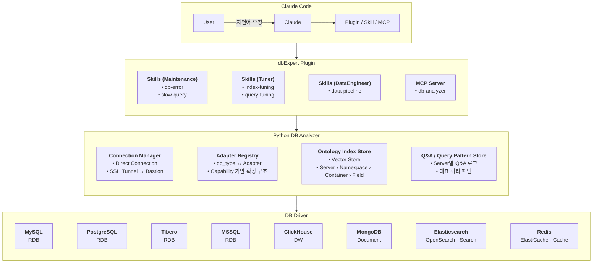

# dbExpert

**Claude Code용 DBA 분석 / 튜닝 / 데이터 파이프라인 Plugin.**

자연어로 "운영 DB가 느려졌어, 원인 분석해줘"라고 물으면 Claude가 Slow Query,
실행계획, Lock/Session, 통계 정보를 MCP Tool로 직접 조회해 DBA 관점에서
원인과 개선안을 설명한다. 8종 Engine(MySQL / PostgreSQL / Tibero / MSSQL /
ClickHouse / MongoDB / Elasticsearch·OpenSearch / Redis)을 하나의 Tool
인터페이스로 다루고, 모든 접근은 **Read Only**로 강제된다.

> *dbExpert is a Claude Code plugin that gives Claude a read-only, multi-engine
> view of your databases (slow queries, execution plans, locks, statistics,
> schema ontology) so it can reason like a DBA / data engineer. Docs are in
> Korean; the code and tool names are in English.*



한 줄 원칙:

> **"DB에 대한 사실은 Python MCP Server가 수집하고, DBA/Data Engineer 수준의
> 판단과 설계는 Claude가 수행한다."**

---

## 무엇을 할 수 있나

| 분류 | Skill | 대표 질문 | 주요 Tool |
|---|---|---|---|
| Maintenance | `db-error`, `slow-query` | "DB 에러 분석해줘", "5초 이상 걸린 SQL 찾아줘" | `db_error_analyze`, `slow_query_list`, `query_explain`, `get_locks`, `get_sessions` |
| Tuner | `index-tuning`, `query-tuning` | "orders 테이블에 필요한 인덱스 추천해줘", "이 쿼리 더 빠르게 고쳐줘" | `index_recommend`, `query_rewrite_suggest`, `get_table_statistics`, `get_index_statistics` |
| DataEngineer | `data-pipeline` | "raw_landing의 원본을 warehouse로 옮기는 파이프라인 설계해줘" | `list_raw_sources`, `get_schema`, `profile_data`, `generate_pipeline_plan`, `validate_pipeline` |
| 공통 기반 | `erd-builder`, `query-builder` | "이 스키마 관계를 ERD로 그려줘", "지난달 지역별 미납 고객 수 알려줘" | `search_object_catalog`, `get_table_relationships`, `find_query_pattern`, `execute_readonly_query`, `log_qa` |

- **Metadata Ontology & RAG** — 테이블/컬럼 comment를 로컬 임베딩(sentence-transformers)
  + LanceDB로 색인해 "고객 주문 관련 테이블 어디 있어?" 같은 자연어 Object 검색을 지원한다.
  외부 API 호출 없음.
- **쿼리 패턴 학습** — Q&A 실행 이력을 JSONL로 남기고 주기적으로 요약해, 비슷한 질문에는
  과거 대표 SQL을 재사용한다.
- **Read Only 3중 방어** — SQL 텍스트 가드 + (지원 Engine은) 연결 직후 서버 세션 자체를
  Read Only로 강제. 실제 MySQL/PostgreSQL 컨테이너에서 "가드를 우회해 raw connection으로
  DELETE해도 서버가 거부"하는 것을 통합 테스트로 확인한다.

MCP Tool 23개, Skill 7개. 전체 Tool 명세는 [`Doc/01_개발정의서.md` §3](Doc/01_개발정의서.md)에 있다.

---

## 빠른 시작

자세한 단계별 가이드(사전 준비물, Extras 선택, HuggingFace 모델, Connection 설정,
트러블슈팅)는 **[`Doc/02_설치.md`](Doc/02_설치.md)** 를 참고한다. 아래는 요약이다.

### 1. 요구사항

| 항목 | 필수 | 비고 |
|---|---|---|
| Python 3.11+ | 필수 | |
| [`uv`](https://docs.astral.sh/uv/) | 필수 | 의존성/venv 관리. `uv.lock`이 커밋되어 있어 동일한 버전이 설치된다 |
| Claude Code CLI | 필수 | |
| Docker | 선택 | 통합 테스트(`tests/integration/`)에서만 |
| JVM + Tibero JDBC jar | 선택 | **Tibero를 쓸 때만**. jar는 저장소에 포함되지 않는다 → [`drivers/tibero/README.md`](drivers/tibero/README.md) |

### 2. 설치

```bash
git clone https://github.com/<your-account>/dbExpert.git
cd dbExpert

# 기본(MySQL/PostgreSQL) + 필요한 Engine extras만 선택
uv sync --extra ontology                   # 스키마 검색/ERD/자연어 조회를 쓰려면 권장
uv sync --extra mongodb --extra clickhouse # 예: 추가 Engine
uv sync --extra all --extra dev            # 전부 + 테스트 도구

uv run --no-sync python -c "import server.main; print('OK')"
```

Extras: `clickhouse` `mongodb` `elasticsearch` `opensearch` `redis` `mssql` `tibero` `ontology` `all` `dev`.

### 3. HuggingFace 임베딩 모델 (Ontology/RAG를 쓸 경우)

`ontology` extra를 설치했다면 **모델 가중치는 별도로 받아야 한다.** `uv sync`는
라이브러리만 설치하고, 모델은 Ontology Tool을 처음 호출하는 순간 HuggingFace Hub에서
받아온다. 그 시점에 수 분이 걸리거나 프록시 환경에서는 실패할 수 있으니 미리 받아두는
것을 권장한다.

| 항목 | 값 |
|---|---|
| 모델 | [`sentence-transformers/paraphrase-multilingual-MiniLM-L12-v2`](https://huggingface.co/sentence-transformers/paraphrase-multilingual-MiniLM-L12-v2) (Apache-2.0, 다국어, 384차원) |
| 용량 | 약 460MB, **최초 1회만** 다운로드 |
| 캐시 위치 | `~/.cache/huggingface/hub/` (`HF_HOME`으로 변경 가능) |

```bash
# 미리 받아두기 (캐시 채움 + 차원 검증)
uv run --no-sync python scripts/download_embedding_model.py

# 폐쇄망: 인터넷 되는 PC에서 디렉터리로 저장해 옮긴 뒤 .env에 경로 지정
uv run --no-sync python scripts/download_embedding_model.py --save-to ./models/multilingual-minilm
#   DBEXPERT_EMBEDDING_MODEL=/abs/path/models/multilingual-minilm
#   HF_HUB_OFFLINE=1
```

Ontology 기능을 쓰지 않으면(Slow Query 조회 등 기본 기능만) 모델은 필요 없고 다운로드도
일어나지 않는다. 상세: [`Doc/02_설치.md` §4](Doc/02_설치.md).

### 4. Connection 설정

접속 정보와 자격증명은 코드가 아니라 두 파일에 두며, 둘 다 `.gitignore`에 등록되어 있다.

```bash
cp config/connections.example.yaml config/connections.yaml   # host/port/database, SSH Bastion 등
cp .env.example .env && chmod 600 .env                        # 계정/비밀번호 실제 값
```

- `connections.yaml`에는 비밀번호를 적지 않는다. `user_env` / `password_env`에 **환경변수
  이름**만 적으면 `ConnectionManager`가 실행 시 `os.environ`에서 읽는다.
- `.env`는 `server/main.py`가 기동 시 `python-dotenv`로 직접 읽는다. Claude Code가 MCP
  Server를 하위 프로세스로 띄울 때 쉘 프로파일을 거치지 않기 때문에, `~/.zshrc`의 `export`만으로는
  전달되지 않는다.
- SSH Bastion 경유는 `ssh.enabled: true` + `login_mode: pem | password`.

```bash
# 읽히는지 확인
uv run --no-sync python -c "
from server.connection.manager import ConnectionManager
m = ConnectionManager('config/connections.yaml'); m.load()
print('loaded:', [c['name'] for c in m.list_connections()]); print('failed:', m.list_load_errors())"
```

### 5. Claude Code에 로드

**방법 A — 세션마다 플래그로 (가장 단순)**

```bash
claude --plugin-dir /path/to/dbExpert
```

**방법 B — Marketplace로 영구 등록.** Claude Code 안에서 슬래시 명령으로 입력한다.

```
/plugin marketplace add <your-account>/dbExpert   # GitHub 저장소로 직접, 또는 로컬 clone 경로
/plugin install dbExpert@dbExpert
```

마켓플레이스 이름과 플러그인 이름이 둘 다 `dbExpert`라 `dbExpert@dbExpert`가 된다.
`/plugin` UI에서는 **Marketplaces** 탭 → 추가 → **Discover** 탭에서 `dbExpert` 선택 → 설치
범위(User/Project/Local) 선택 → 필요 시 `/reload-plugins`. `.mcp.json`의 `db-analyzer` MCP
Server는 Plugin과 함께 자동 등록된다.

세션에서 `prod-aurora 연결 상태 확인해줘`(본인 Connection 이름으로)라고 물어 `db_ping`이
`{"connected": true, ...}`를 돌려주면 설치 완료다.

---

## 저장소 구성

```
.claude-plugin/     plugin.json / marketplace.json (Claude Code Plugin 매니페스트)
.mcp.json           db-analyzer MCP Server 기동 정의 (uv run server/main.py)
skills/             7개 SKILL.md — Claude가 언제 어떤 Tool을 어떤 순서로 쓸지에 대한 지침
server/
  main.py           MCP Server 진입점, 23개 Tool 등록
  database/         Capability 기반 Adapter 8종 + AdapterRegistry (신규 Engine 추가 지점)
  connection/       Connection Profile 로더, SSH Tunnel
  analyzer/         Slow Query / Error / Lock·Session / 통계 / Index·Rewrite 제안
  pipeline/         Raw Data 탐색, 프로파일링, Pipeline 설계·검증
  catalog/          Ontology 구축·검색, ERD, 임베딩, 쿼리 트리거 자동 갱신
  learning/         Q&A 로그(백그라운드 기록), 쿼리 패턴 요약
  query_builder/    자연어 조회용 패턴 검색 / Read Only 실행
  sql/, query/      Engine별 SQL·Query DSL 템플릿
config/             connections.example.yaml
data/               런타임 생성물 (Connection별 LanceDB 인덱스, QA 로그) — 커밋되지 않음
drivers/tibero/     Tibero JDBC jar 위치 (jar는 사용자가 직접 준비)
scripts/            download_embedding_model.py
tests/              단위 테스트 + tests/integration/ (Docker testcontainers)
Doc/                요건정의서 · 개발정의서 · 설치 가이드 · 개발 히스토리
```

---

## 문서

| 문서 | 내용 |
|---|---|
| [`Doc/00_개발요건사항.md`](Doc/00_개발요건사항.md) | 요건정의서 (What / Why). 목적, Skill 분류, Engine·Capability, 보안/Read Only 정책, 27개 Phase 로드맵, MVP 기준 |
| [`Doc/01_개발정의서.md`](Doc/01_개발정의서.md) | 개발정의서 (How). Tool 명세, 데이터 모델, 모듈 설계, 처리 흐름, 미결정 사항과 그 해결 |
| [`Doc/02_설치.md`](Doc/02_설치.md) | 설치 가이드. 실제로 실행해 확인한 명령과 겪은 문제 기준 |
| [`Doc/03_개발히스토리.md`](Doc/03_개발히스토리.md) | **개발 배경에서 완료까지의 히스토리.** 왜 이렇게 설계했고, 중간에 무엇이 바뀌었고, 무엇을 배웠는지 |

두 설계 문서(00/01)가 SSOT다. 코드와 문서가 어긋나면 문서를 먼저 갱신한 뒤 코드를 맞춘다.
코드 주석의 `§` 참조는 이 문서들의 절 번호다.

---

## 테스트

```bash
uv sync --extra all --extra dev

uv run pytest -m "not integration and not real_embeddings"   # 단위 테스트 (Fake 기반, 빠름)
uv run pytest -m integration                                  # Docker로 실제 MySQL/PostgreSQL 기동 (느림)
uv run pytest -m real_embeddings                              # 실제 임베딩 모델 로드 (모델 다운로드 필요)
```

검증 범위를 있는 그대로 적어둔다.

- **MySQL / PostgreSQL**: 단위 테스트 + Docker 컨테이너 통합 테스트 통과. Read Only 서버 강제까지 검증.
- **Tibero**: Tibero 5.0 서버 + JDBC 6.0.166454 조합에서 실제 접속 확인.
- **MSSQL / ClickHouse / MongoDB / Elasticsearch·OpenSearch / Redis**: Fake Client 기반 단위 테스트만
  통과. 실제 서버 검증은 사용자 환경에서 필요하다.

---

## 보안과 Read Only

- 모든 Adapter는 기본 Read Only. `INSERT/UPDATE/DELETE/DDL/GRANT`와 `SELECT ... INTO OUTFILE`류
  쓰기 부작용 구문을 텍스트 가드가 차단하고, MySQL/PostgreSQL/ClickHouse/Tibero는 연결 직후
  서버 세션을 Read Only로 강제한다. MSSQL은 세션 강제 수단이 없어 **별도 Read Only 계정 사용을
  강력히 권장**한다.
- `EXPLAIN ANALYZE`처럼 실제 실행이 동반되는 기능은 기본 비활성(`REQUIRES_EXPLICIT_APPROVAL`).
- 비밀번호는 평문 저장 금지. `.env` + 환경변수 이름 참조 방식만 지원.
- Ontology 인덱스와 Q&A 로그에는 Row 값·비밀번호·토큰을 넣지 않는다. Q&A 로그의 SQL은 리터럴이
  `?`로 마스킹된다.
- `KILL`, 세션 종료, 재시작 같은 운영 명령은 Tool로 제공하지 않는다.

---

## 확장하기 (새 Engine 추가)

1. `server/database/<engine>.py`에 `BaseAdapter`를 상속한 Adapter를 만들고, 지원하는
   `Capability`만 구현한다.
2. `server/database/registry.py`의 `register_builtin_adapters()`에 `db_type ↔ Adapter`를 등록한다.
3. `pyproject.toml`에 해당 드라이버를 extra로 추가한다.

Skill/Tool 코드는 바꾸지 않는다. Capability가 없는 기능은 오류가 아니라 `CAPABILITY_NOT_SUPPORTED`로
응답한다 ([`Doc/00_개발요건사항.md` §7.3](Doc/00_개발요건사항.md)).

---

## 라이선스

[MIT](LICENSE). 단, 다음은 별도 라이선스의 서드파티 산출물로 이 저장소에 포함되지 않는다.

- Tibero JDBC 드라이버 (TmaxData) — 사용자가 직접 준비.
- 임베딩 모델 `paraphrase-multilingual-MiniLM-L12-v2` (Apache-2.0) — 최초 실행 시 HuggingFace Hub에서 다운로드.
